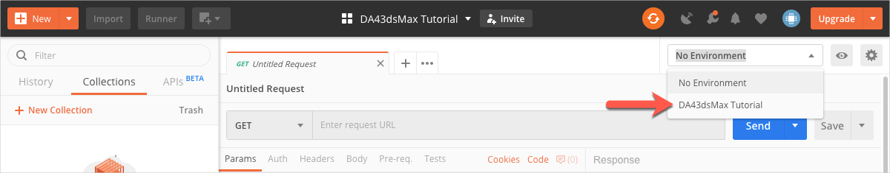

# Before you begin...

## 1. Import Postman Environment for the tutorial

Postman Environments are named configurations that implement variables to store values you typically use across many HTTP requests. For example, the Access Token that must be used across all HTTP requests is saved to a variable named `dasApiToken`. To import the environment you need for this tutorial:

1. Download the file *DA43dsMax Tutorial.postman_environment.json* from the [*collections* folder of this repository](../collections).

2. Import *DA43dsMax Tutorial.postman_environment.json*:

    1. In the Postman header bar, click **Import**. A dialog displays.

    2. Drag the file you downloaded in step 1 to the area marked **Drop files here**.

3. Click the **Environment drop-down** on the upper-right, and select **DA43dsMax Tutorial**. The DA43dsMax Tutorial environment loads.

   

## 2. Import the Postman Collection for the tutorial.

Postman Collections are groups of prepopulated HTTP requests. To import the requests you need for this tutorial:

1. Download the file *DA43dsMax Tutorial.postman_collection.json* from the [*collections* folder of this repository](../collections).

2. Import *DA43dsMax Tutorial.postman_collection.json*:

    1. In the Postman header bar, click **Import**. A dialog displays.

    2. Drag the file you downloaded in step 1 to the area marked **Drop files here**.

[:rewind:](../readme.md "readme.md")  [:arrow_forward:](task-1.md "Next task")
