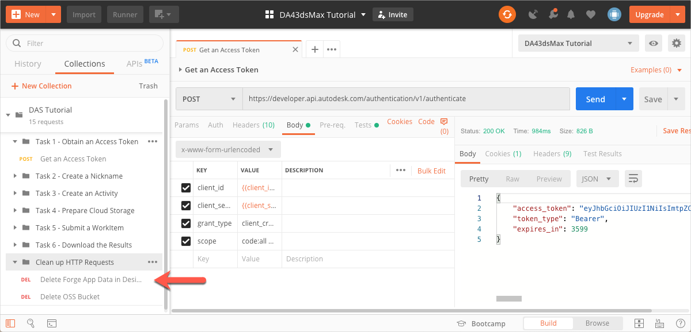
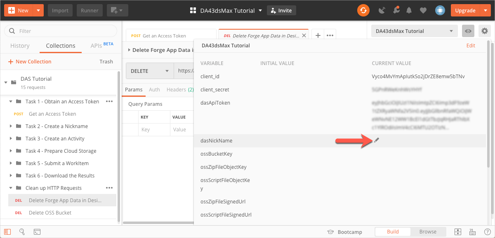
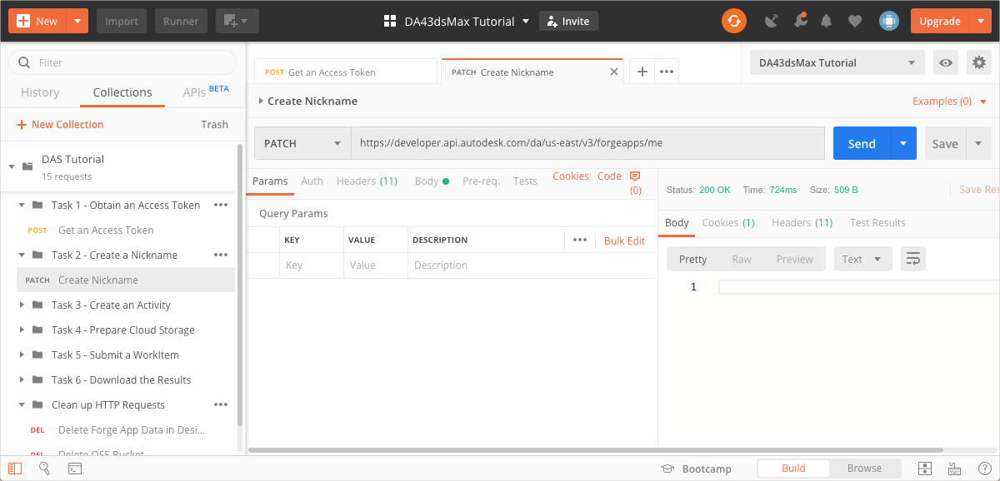

# Task 2 - Create a Nickname

Forge uses the Client ID to uniquely identify an app. The Client ID can be long and cryptic, and hence a source of irritation when you reference your app.

A Nickname lets you map a Client ID to an easy-to-use name that you can use in place of the Client ID. This tutotial uses the `dasNickName` Postman Environment Variable to store the Nickname. 

**Notes:**

- If your Forge App doesn't have any data, you can map the Forge App to another nickname, and the new nickname will overwrite the old one. Once your add data to a Forge App, you are not allowed to set a nickname for it. This is true even if you have not yet assigned a nickname for the app. The only way you can assign a nickname to an app with data is by first calling the `[DELETE] /forgeapps/me` endpoint. This deletes all data associated with that app, including the nickname. The penultimate request in this Postman Collection (**Clean up HTTP Requests > DEL Delete Forge App Data in Design Automation**) calls this endpoint and clears the app of all data.

    

- If you get stuck while working on this tutorial, and are unable to procede because your app has data, you can use **DEL Delete Forge App Data in Design Automation** to clear all data from the app, and restart from Task 1.

- Nicknames must be globally unique.  If the nickname is already in use, even by someone else, Forge returns a `409 Conflict` error when you try to set the Nickname.

## Save the Nickname to a variable

1. Click the **Environment quick look** icon on the upper right corner of Postman. 

2. In the **CURRENT VALUE** column, in the **dasNickName** row, enter a Nickname for your app.

   

3. Click the **Environment quick look** icon again, to hide the variables.

## Send a request to set the Nickname

1. On the Postman sidebar, click **Task 2 - Create a Nickname > PATCH Create Nickname**. The request loads.

2. Click  **Send**. If the request is sucessful, you should see a response similar to the following image. Note that the response has only a header and no body.

     

[:arrow_backward:](task-1.md)  [:arrow_up_small:](../readme.md)  [:arrow_forward:](task-3.md)
