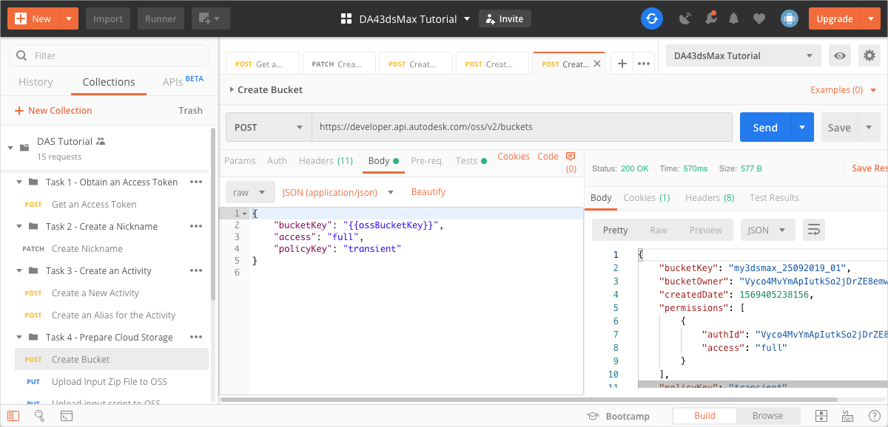
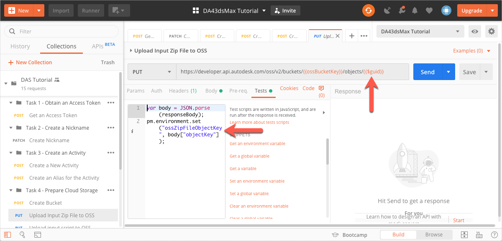
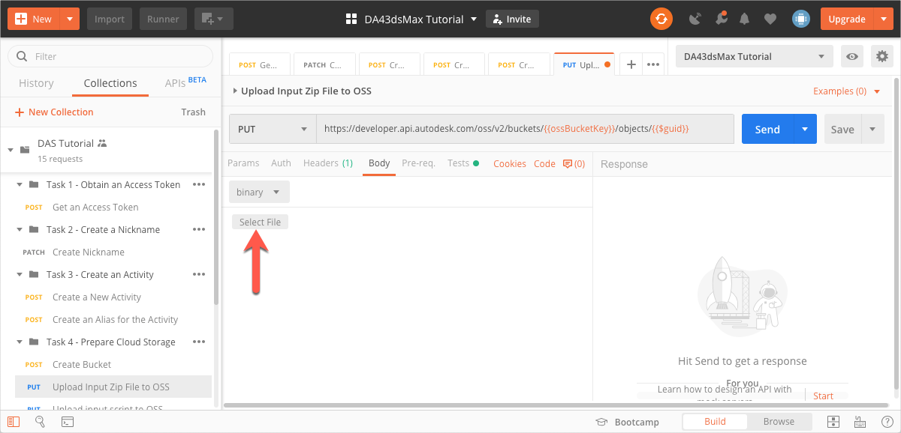
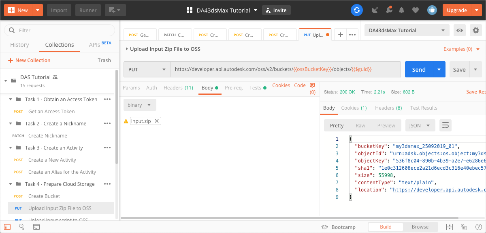
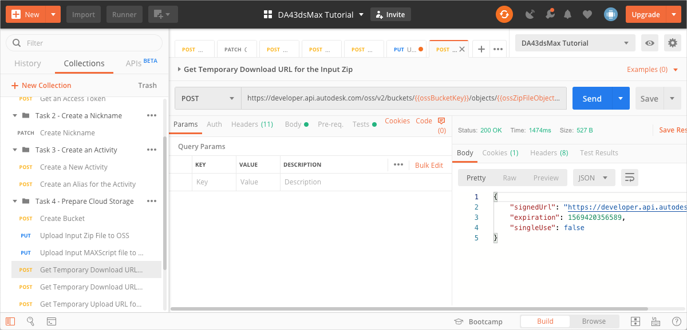
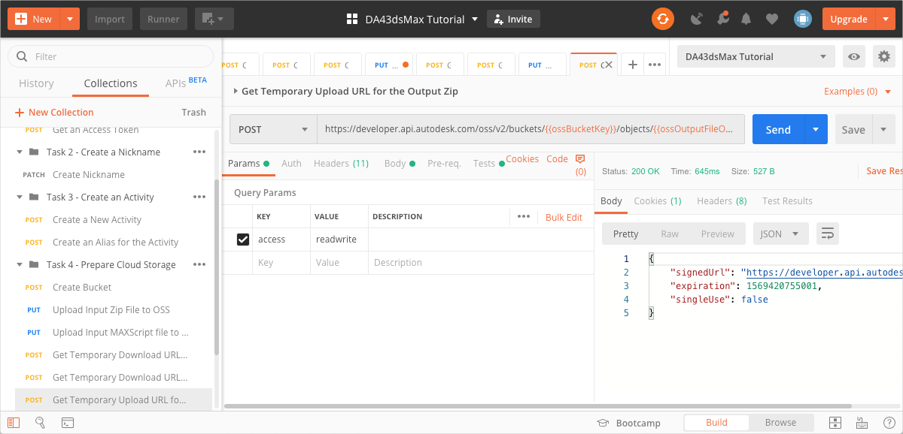

# Task 4 - Prepare cloud storage

When Design Automation executes the Activity you created in Task 3, it must access the 3ds Max scene file to process and the MAXScript file to run. Design Automation also needs to upload the output of the Activity. In this task, you will use the Data Management API to access the Forge Object Storage Service (OSS) for this purpose. You will also generate temporary signed URLs to let Design Automation download the input files and upload the output file.

## Create a Bucket

You use a Postman Environment Variable named `ossBucketKey` for the object key of the Bucket that holds your files in the cloud.

1. Specify a value for the bucket object key in the Postman Environment Variable named `ossBucketKey`:

    1. Click the **Environment quick look** icon on the upper right corner of Postman. 

    2. In the **CURRENT VALUE** column, in the **ossBucketKey** row, specify a name the Bucket that stores your files.

        **Notes:**  
        - The bucket name needs to be unique throughout the OSS service. At the time you create a bucket, you may need to change the value of this variable if a bucket with the name you specified already exists. 
        
        - The bucket name must consist of only lower case characters, numbers 0-9, and the underscore (_) character.

    3. Click the **Environment quick look** icon to hide the variables.

4. On the Postman sidebar, click **Task 4 - Prepare Cloud Storage > POST Create Bucket**. The request loads.

5. Click the Body tab, and verify that the `bucketkey` attribute has been set to the variable `ossBucketKey`.

5. Click **Send**. If the request is successful, you should see a screen similar to the following image.

    

## Upload 3ds Max scene file to OSS

1. Download the zip file containing the 3ds Max scene file, *input.zip* from the [*tutorial_data* folder of this repository](../tutorial_data).

2. On the Postman sidebar, click **Task 4 - Prepare Cloud Storage > PUT Upload Input ZIP File TO OSS**. The request loads.

    Note the use of the Postman Dynamic variable `guid` as a query string parameter as the object key of the zip file. This variable generates a unique ID for the object key. A script specified in the **Tests** tab saves the object key to a Postman Environment Variable named `ossZipFileObjectKey`

    

3. Click the **Body** tab.

4. Click **Select File** and pick the zip file you downloaded in step 1.

    

5. Click **Send**. The request is sent, and the Postman Environment Variable `ossZipFileObjectKey` is updated. If your request is successful, you should see a screen similar to the following image:

    

## Upload MAXScript file to OSS

1. Download the zip file containing the 3ds Max scene file, *Twistit.ms* from the [*tutorial_data* folder of this repository](../tutorial_data).

2. On the Postman sidebar, click **Task 4 - Prepare Cloud Storage > PUT Upload Input MAXScript File TO OSS**. The request loads.

3. Click the **Body** tab.

4. Click **Select File** and pick the MAXScript file you downloaded in step 1.

5. Click **Send**. The request is sent, and the Postman Environment Variable `ossScriptFileObjectKey` is updated. If the request is successful, the response status should be `200 OK`.

## Get temporary download URL for 3ds Max scene file

Design Automation needs to download the 3ds Max scene file to process it. This request obtains a temporary signed URL that Design Automation can use to download the file. The signed URL is saved it to a Postman Environment Variable.

1. On the Postman sidebar, click **Task 4 - Prepare Cloud Storage > POST Get Temporary Download URL for the Input Zip**. The request loads.

2. Click **Send**. If the request is successful, you should see a screen similar to the following image. Furthermore, the signed URL is saved to the `ossZipFileSignedUrl` Postman Environment Variable.

    

## Get temporary download URL for MAXScript file

This request obtains a temporary signed URL that Design Automation can use to download the MAXScript file when it executes the Activity. The signed URL is saved it to a Postman Environment Variable.

1. On the Postman sidebar, click **Task 4 - Prepare Cloud Storage > POST Get Temporary Download URL for the Input Script**. The request loads.

2. Click **Send**. The signed URL is saved to the `ossScriptFileSignedUrl` Postman Environment Variable. If the request is successful, the response status should be `200 OK`.

## Get temporary upload URL

Design Automation needs a signed URL to upload the output that is generated. This request obtains a temporary signed URL that Design Automation can use to upload the file, and saves it to a Postman Environment Variable.

1. Click the **Environment quick look** icon on the upper right corner of Postman. 

2. In the **CURRENT VALUE** column, in the **ossOutputFileObjectKey** row, specify an Object Key (a name to identify the output file, once it is uploaded to OSS).

3. Click the **Environment quick look** icon to hide the variables.

4. On the Postman sidebar, click **Task 4 - Prepare Cloud Storage > POST Get Temporary Upload URL for the Output Zip**. The request loads.

5. Click **Send**. If the request is successful, you should see a screen similar to the following image. Furthermore, the signed URL is saved to the `ossUploadURL` Postman Environment Variable.

    

[:arrow_backward:](task-3.md)  [:arrow_up_small:](../readme.md)  [:arrow_forward:](task-5.md)

