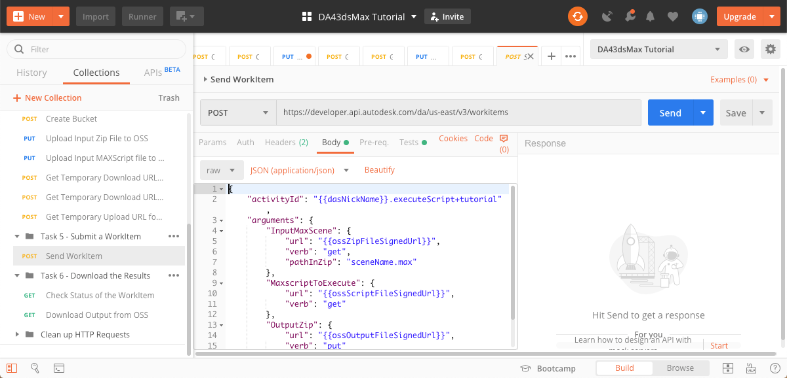
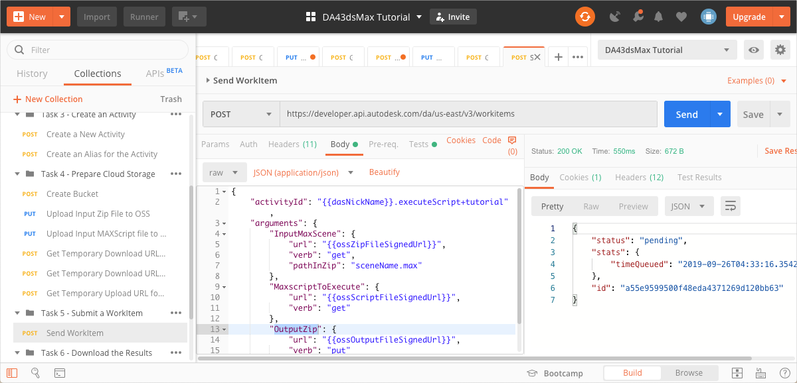

# Task 5 - Submit a WorkItem

When you submit a WorkItem to Design Automation, you are instructing Design Automation to execute the Activity specified in the WorkItem.

## Create a WorkItem

1. On the Postman sidebar, click **Task 5 - Submit a WorkItem > Send WorkItem**. The request loads.

2. Click the **Body** tab and take note of the JSON payload.

    

    The main attributes on the JSON payload are:

    - `activityId` - Specifies what Activity to execute. The id you specify here must be a fully qualified id. A fully qualified id is made up of three parts. They start with the Nickname of the Forge App (or the Client Id of the Forge App. The Nickname is followed by the '.' character, which in turn is followed by the Activity name. This is followed by the '+' character and finally the Activity Alias. For more information on fully qualified ids and unqualified ids, see the [Forge portal documentation on ids](https://forge.autodesk.com/en/docs/design-automation/v3/developers_guide/aliases-and-ids/#ids).

    - `arguments` - Contains all the parameters that need to be passed to the Activity specified by `activityId`. They must match the parameters you specified in Task 3, when you created the Activity.

    - `InputMaxScene` - Specifies how to obtain the 3ds Max scene file for the Activity. It contains the signed URL to the scene file or a zip file that contains the scene file. This is followed by the HTTP verb that gets the file. If you uploaded a zip file in task 4, use the `pathInZip` attribute to specify the relative path to the 3ds Max file. If you uploaded a 3ds Max file instead of a zip file, do not specify the `pathInZip` attribute.

    - `MaxscriptToExecute`- Specifies how to obtain the MAXScript file for the Activity. Contains the signed URL to download the MAXScript file.

    - `OutputZip` - Specifies the signed URL to the location reserved for the output of the activity, followed by the HTTP verb to use.

3. Click **Send**. The WorkItem ID is saved to the `dasWorkItemId` Postman Environment Variable. If the request is successful you should see a screen similar to the following image.

    

[:rewind:](../readme.md "readme.md") [:arrow_backward:](task-4.md "Previous task") [:arrow_forward:](task-6.md "Next task")
