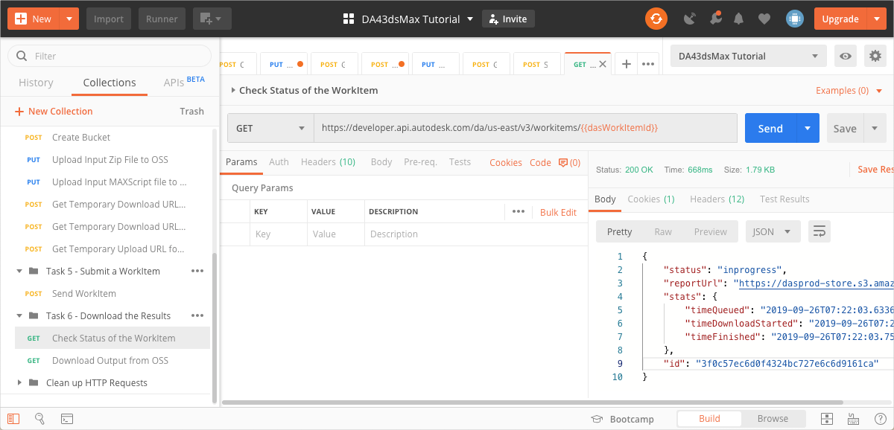
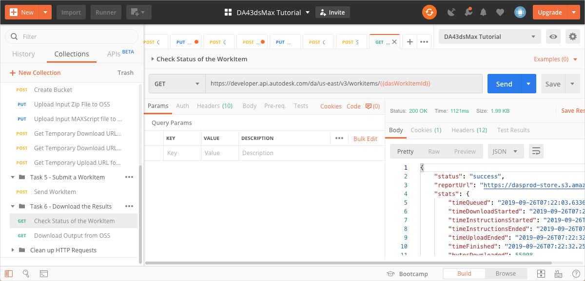
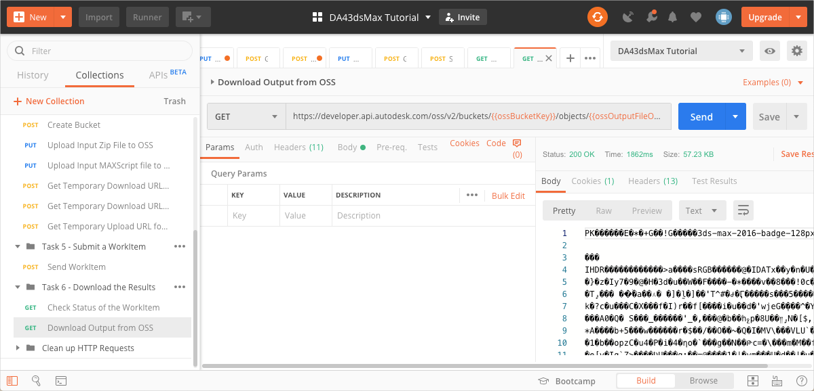
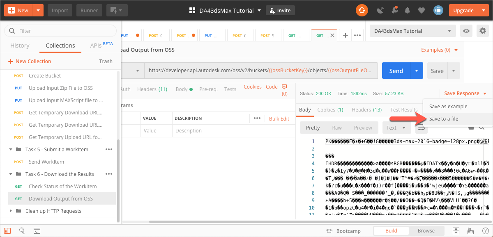

# Task 6 - Download the Results

Before you download the result, the WorkItem must complete execution. You can periodically check the status of the WorkItem and download the results once execution is complete. Alternatively, you can get Design Automation to send a POST request to a callback URL you specify, once execution is done. For this tutorial, you will check the status of the WorkItem. Check the [Forge Portal](https://forge.autodesk.com/en/docs/design-automation/v3/developers_guide/callbacks/) for information on how to specify the Callback URL.

## Check Status of a WorkItem

Design Automation WorkItems are queued before they are processed. Processing itself can take time. Once processing is done, you need to know if the WorkItems ran successfully or not. As such it is important for you to check the status of the WorkItem you created.

1. On the Postman sidebar, click **Task 6 - Download the Result > GET Check Status of the WorkItem**. The request loads.

2. Click **Send**. You should see a screen similar to the following image.

    

3. Repeat step 2, until you see a screen similar to the following image, where the status reads `success`.

    

## Download the outpout from OSS

1. On the Postman sidebar, click **Task 6 - Download the Result > GET Check Status of the WorkItem**. The request loads.

2. Click **Send**. You should see a screen similar to the following image.

    

3. In the result sections, click **Save Response > Save to a file**. The output file downloads.

    

[:arrow_backward:](task-4.md)  [:arrow_up_small:](../readme.md)  [:arrow_forward:](task-6.md) 