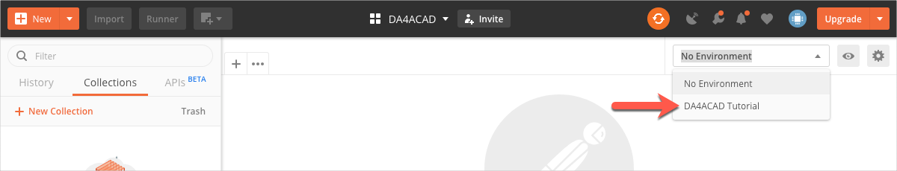

# Before you begin...

## 1. Import Postman Environment for the tutorial

Postman Environments are named configurations that implement variables to store values you typically use across many HTTP requests. For example, your access token, which has to specified with every request you send to Forge, is stored in an environment variable named `dapAccesssToken`. To import the environment you need for this tutorial:

1. Download the file *DA4ACAD Tutorial.postman_collection.json* from the [*collections* folder of this repository](../collections).

2. Import *DA4ACAD Tutorial.postman_collection.json*

    1. In the Postman header bar, click **Import**. A dialog box displays.

    2. Drag the file you downloaded in step 1 to the area marked **Drop files here**.

3. Click the **Environment drop-down** on the upper-right, and select **DA4ACAD Tutorial**. The environment loads.
   

## 2. Import the Postman Collection for the tutorial.

Postman Collections are groups of prepopulated HTTP requests. To import the requests you need for this tutorial:

1. Download the file *DA4Revit-Collection.postman_collection.json* from the [*collections* folder of this repository](../collections).

2. Import *DA4ACAD Tutorial.postman_environment.json*

    1. In the Postman header bar, click **Import**. A dialog displays.

    2. Drag the file you downloaded in step 1 to the area marked **Drop files here**.

## 3. Get an AutoCAD CRX plug-in 

- | Download the AutoCAD CRX plug-in, *command.dll* (and all other files required for this tutorial) from the [*tutorial_data* folder of this repository](../tutorial_data)
  | This CRX implements a command named **TEST**, which extracts the layer names of the current drawing and saves those names to a text file.

[:rewind:](../readme.md "readme.md")  [:arrow_forward:](task-1.md "Next task")
