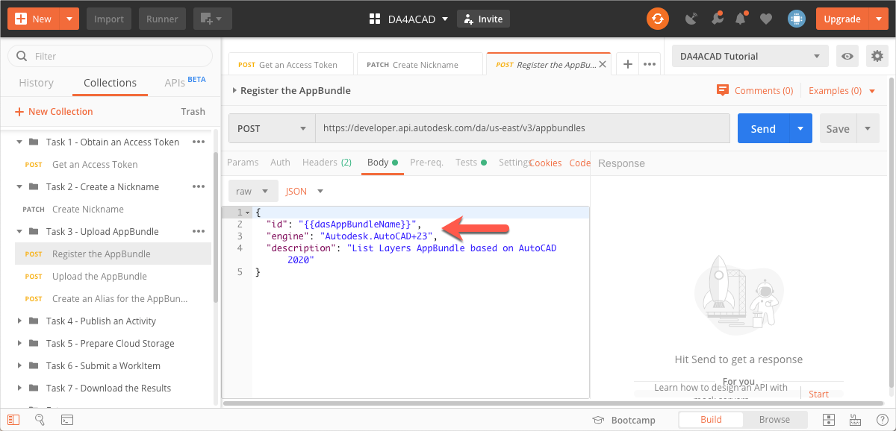
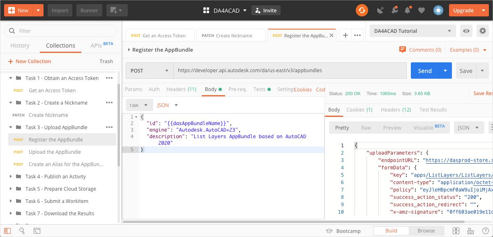
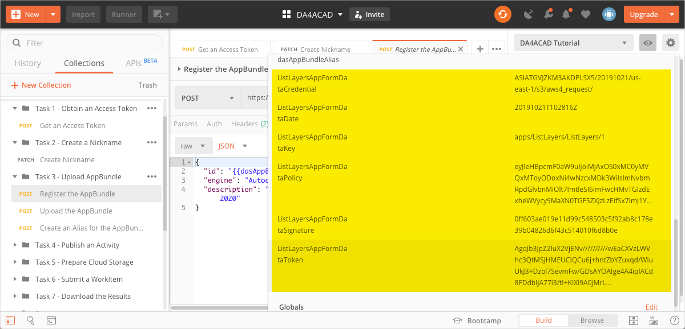
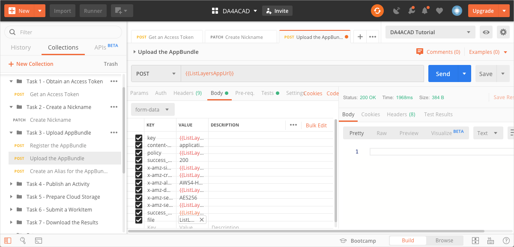
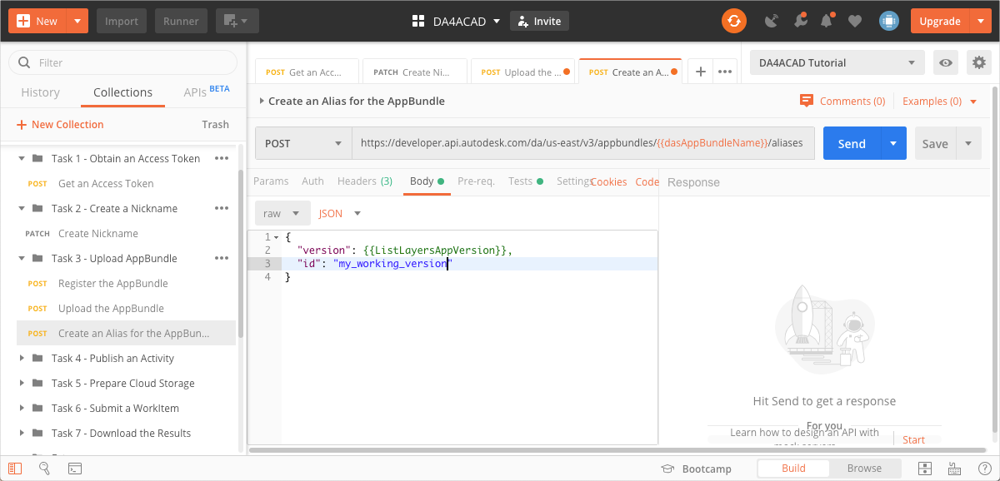
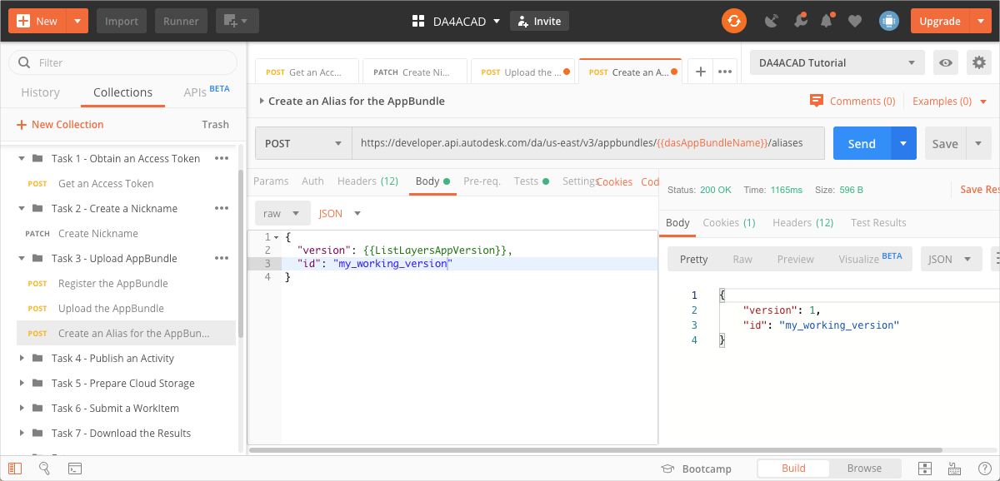

# Task 3 - Upload an AppBundle to Design Automation

An AppBundle is a package of binaries and supporting files that make up a AutoCAD plug-in. See the corresponding [task in the Step-by-Step tutorial on the Forge Portal](https://forge.autodesk.com/en/docs/design-automation/v3/tutorials/autocad_new/task-3-upload-appbundle/) for an explanantion of AppBundles and learn how to create an AppBundle. For the purpose of this Postman tutorial,  download *ListLayers.zip*, which is stored in the [*tutorial_data* folder of this repository](../tutorial_data). The file *command.dll* that is contained within this AppBundle is designed to run on AutoCAD 2020.

## Register the AppBundle

When registering the AppBundle, you inform Design Automation that you want to name it ListLayers, and that it must run on AutoCAD 2020.

1. On the Postman sidebar, click **Task 3 - Upload AppBundle > POST Register the AppBundle**. The request loads.

2. This request picks up the AppBundle name from the Postman Environment Variable `dasAppBundleName`. Set this variable to the name *ListLayers*.

    **Note:** you can use any name you want. However, in  order to match the screen captures and the cURL tutorial in the Forge portal, this tutorial uses the name *ListLayers*.

    1. Click the **Environment quick look** icon on the upper right corner of Postman. 

    2. In the **CURRENT VALUE** column, in the **dasAppBundleName** row, enter *ListLayers**.

2. Click the **Body** tab, and verify that the `id`, is set to the `dasAppBundleName` variable and `engine` is set to `DeleteWallsApp`, and `Autodesk.Revit+2018`.

     

3. Click **Send**. If the request is successfull, you will see a screen similar to the following image:

    

    The `endpointURL` and `formData` information required to upload the AppBundle is saved to Postman Environment variables.

    

## Upload the AppBundle

1. On the Postman sidebar, click **Task 3 - Upload AppBundle > POST Upload the AppBundle**. The request loads.

2. Click the **Body** tab, and scroll down such that the **file** row is visible.

3. Click **Select Files**, and pick *DeletWallsApp.zip*, which you downloaded earlier.

    

5. Click **Send**. You should see a screen similar to the following. Note that the response has only a header and no body.

    

## Create an Alias for the AppBundle

When you registered the AppBundle earlier, it was registered as version 1 of the AppBundle. Now, you create an alias named *my_working_version* to reference that version.

1. On the Postman sidebar, click **Task 4 - Upload AppBundle > POST Create an Alias for the AppBundle**. The request loads.

2. Click the **Body** tab. and note how `id` is set to`my_working_version`.

    

3. Click **Send**. You should see a response similar to the following image.

    

[:rewind:](../readme.md "readme.md") [:arrow_backward:](task-2.md "Previous task") [:arrow_forward:](task-4.md "Next task")
