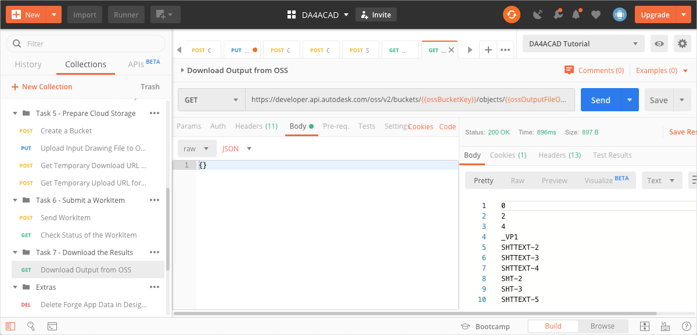

# Task 7 - Download the results

Once the WorkItem has completed executing the Activity, Design Automation uploads the resulting text file to OSS. You use the Fore Data Management API to download the text file to your local machine.

## Download the output from OSS

1. On the Postman sidebar, click **Task 6 - Download the Result > GET Download Output from OSS**. The request loads.

2. Click **Send**. You should see a screen similar to the following image.

    

3. In the response area, click **Save Response > Save to a file**. The output file downloads. Save the file as a *.zip* file, when prompted to.

    

[:rewind:](../readme.md "readme.md") [:arrow_backward:](task-6.md "Previous task")