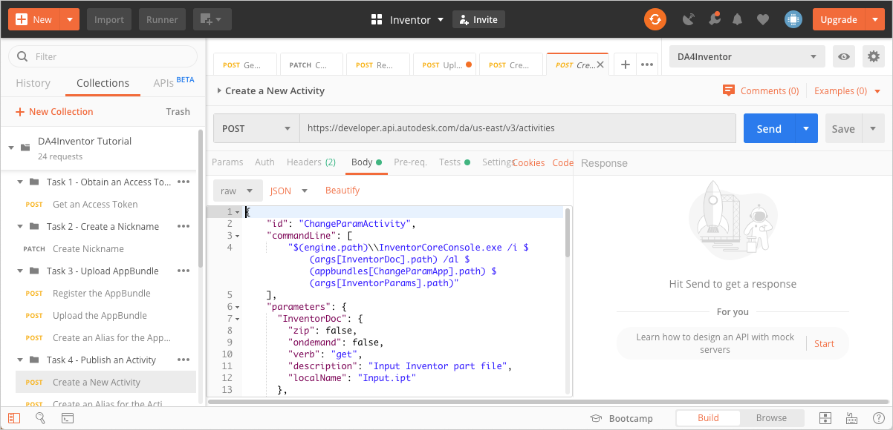
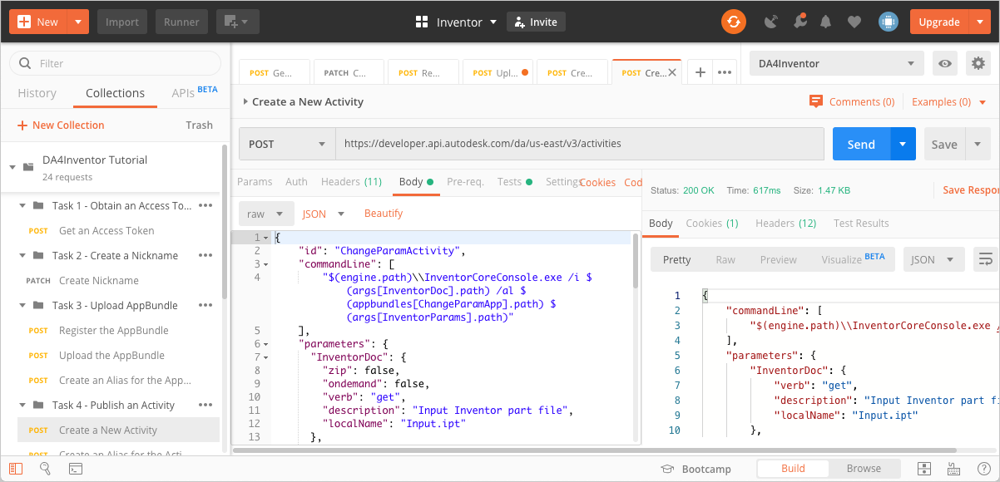
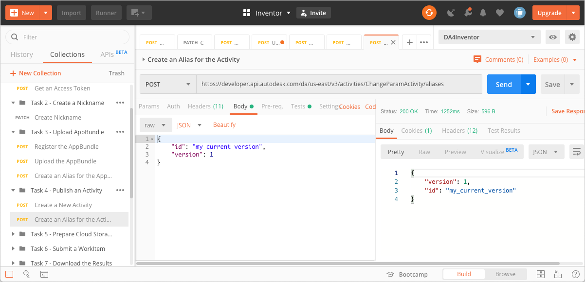

# Task 4 - Create an Activity

An Activity is an action that can be executed in Design Automation. 

## Create a New Activity

1. On the Postman sidebar, click **Task 4 - Publish an Activity > POST Create a New Activity**. The request loads.

2. Click the **Body** tab. Observe the body parameters.

    

**Notes:**
 - `id` is the name given to the new Activity. The id is picked up from the Postman Environment Variable `dasActivityName`. 
 - `commandLine` is the command run by this Activity. It consists of several variables. These variables are replaced by actual values at the time the Activity is executed. This mechanism provides the ability to test the command line locally with file paths that are applicable to Design Automation. For more information, see the [Forge portal documentation on command lines](https://forge.autodesk.com/en/docs/design-automation/v3/developers_guide/field-guide/#command-lines).

    - `$(engine.path)\\accoreconsole.exe` - The full path to the AutoCAD engine. The version of AutoCAD to be used is defined in the request body as `"engine": "Autodesk.AutoCAD+22"`.  

    - `$(args[InputDwg].path)` - The full path to the folder that the file identified by the parameter InputDwg (by the WorkItem that invokes this Activity) is downloaded to. 

    - `$(appbundles[{{dasAppBundleName}}].path)` identifies the path to where the specified AppBundle is unzipped to. The AppBundle is specified in the request body as `"appbundles": [ "{{dasNickName}}.{{dasAppBundleName}}+{{dasAppBundleAlias}}"]`. Note the use of Postman Variables to specify the Nickname, AppBundle Id, and the AppBundle version alias.

    - `$ (settings[script].path` identifies the path to the file where Design Automation saves the value of the setting named `script`. See [AutoCAD documentation on Command Scripts](https://help.autodesk.com/view/ACD/2020/ENU/?guid=GUID-95BB6824-0700-4019-9672-E6B502659E9E) for information on writing scripts.

- `parameters` defines the inputs and outputs that need to be provided when the Activity is executed. Input parameters are identified by the attribute `"verb":"get"`. Output parameters are identified by the attribute `"verb":"put"`. 

 - `engine` is the Design Automation engine that the Activity (AutoCAD 2020 in this case) runs on.

 - `settings` specifies the command script to be run by the activity. In this case, it calls the custom command TEST. 

3. Set the `dasActivityName` Postman Variable to `ListLayerActivity`.

    1. Click the **Environment quick look** icon on the upper right corner of Postman.

    2. In the **CURRENT VALUE** column, in the **dasAppBundleName** row, enter ListLayers.

    3. Click the **Environment quick look** icon again.

3. Click **Send**. If the request is successful, you should see a screen similar to the following image.

    

## Create an Alias to the Activity

When you created an Activity earlier, you created version 1 of the Activity. You can create new versions of the Activity and make improvements with time.  The `id` of an Activity alone is not sufficient to define which version of an Activity Design Automation must execute. You use an Alias for this purpose.  You can think of an Alias as a tag that points to a particular version of an Activity. The version that an Alias points to can be changed as you develop more versions of a given Activity.

To create an alias named `my_current_version`, which refers to version `1` of the `ListLayersActivity`:

1. On the Postman sidebar, click **Task 4 - Create an Activity > POST Create an Alias to the Activity**. The request loads. 

2. Click the **Body** tab, and observe how the alias id has been set to `my_current_version`. 

3. Click **Send**. If the request is successful, you should see a screen similar to the following image.

    

[:rewind:](../readme.md "readme.md") [:arrow_backward:](task-3.md "Previous task") [:arrow_forward:](task-5.md "Next task")
