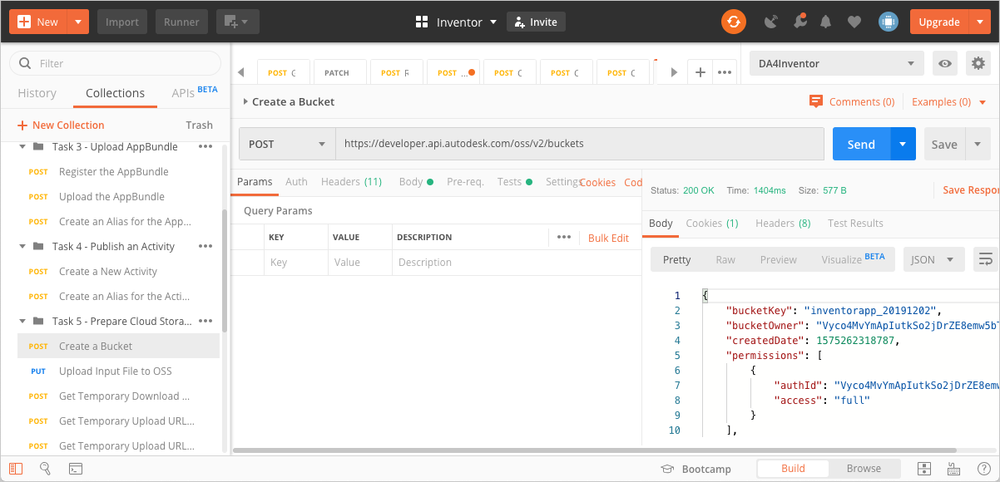
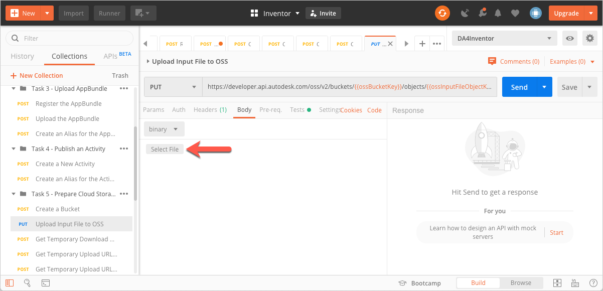
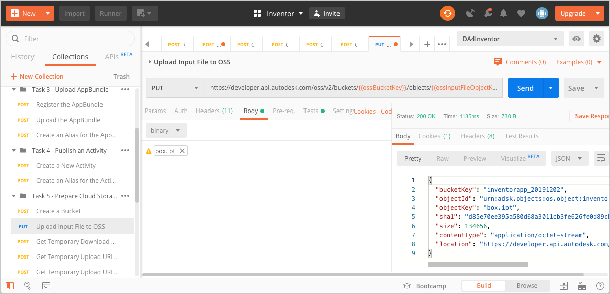
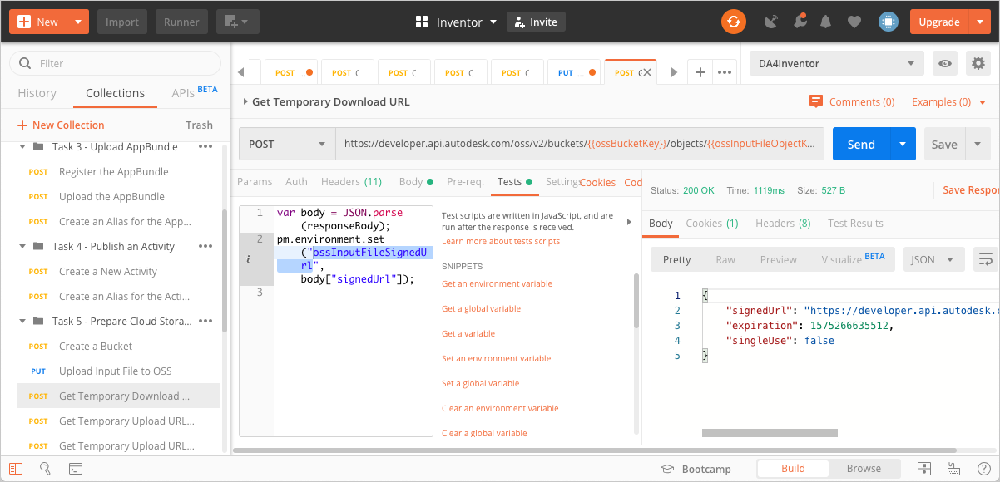
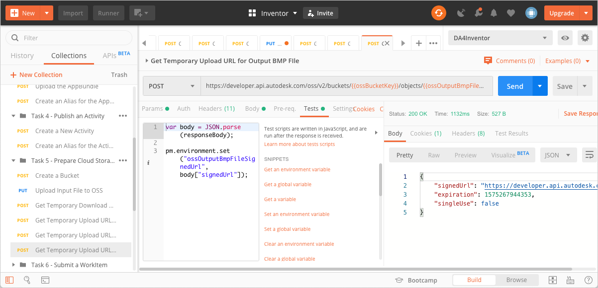

# Task 5 - Prepare cloud storage

The Activity ChangeParamActivity resizes an Inventor part or assembly to a height and width you specify (as a JSON object). It also produces an image of the resized part or assembly. In this task, we prepare a cloud storage service to hold the input Inventor files, and the output (resized) Inventor files and image file. While you can use any cloud storage service for this purpose, this tutorial uses the Object Storage Service (OSS) through the Forge Data Management API.

This tutorial provides instructions to assist you resize an Inventor part. We encourage you to try resizing an Inventor Assembly on your own, later.

There are five Postman Environment Variables you must specify for this task. They are
- `ossBucketKey` - The Bucket Key for the Bucket that holds your files in the cloud.
- `ossInputFileObjectKey` - The Object Key of the Inventor Part file.
- `ossOutputIptFileObjectKey` - The Object Key of the placeholder for the resized part the activity produces.
- `ossOutputIamFileObjectKey` - The Object Key of the placeholder for the resized assembly the activity produces. 
- `ossOutputBmpFileObjectKey` - The Object Key of the placeholder for the image file the activity produces. 

## Create a Bucket

1. Click the **Environment quick look** icon on the upper right corner of Postman.

2. In the **CURRENT VALUE** column, in the **ossBucketKey** row, specify a name the Bucket that stores your files.

    **Notes:**  
    - The Bucket name needs to be unique throughout the OSS service. if a Bucket with the name you specified already exists, the system will return a `409` conflict error in step 5. If you recieve this error, change the value of this variable and try again.

    - The Bucket name must consist of only lower case characters, the numbers 0-9, and the underscore (_) character.

3. Click the **Environment quick look** icon to hide the variables.

4. On the Postman sidebar, click **Task 5 - Prepare Cloud Storage > POST Create a Bucket**. The request loads.

5. Click **Send**. If the request is successful, you should see a screen similar to the following image.

    

## Upload input file to OSS

1. Download the input file, *box.ipt* from the [*tutorial_data* folder of this repository](../tutorial_data).

2. Click the **Environment quick look** icon on the upper right corner of Postman.

3. In the **CURRENT VALUE** column, in the **ossInputFileObjectKey** row, specify an Object Key (a name to identify the input file, once it is uploaded to OSS).

4. Click the **Environment quick look** icon to hide the variables.

5. On the Postman sidebar, click **Task 5 - Prepare Cloud Storage > PUT Upload Input File**. The request loads.

6. Click the **Body** tab.

7. Click **Select File** and pick the file you downloaded in step 1.

    

8. Click **Send**. If your request is successful, you should see a screen similar to the one below:

    

## Get temporary download URL

Design Automation needs to download the input file to process it. This request obtains a temporary signed URL that Design Automation can use to download the file. The URL expires in an hour.

1. On the Postman sidebar, click **Task 5 - Prepare Cloud Storage > POST Get Temporary Download URL**. The request loads.

2. Click **Send**. If the request is successful, you should see a screen similar to the following image. Furthermore, a script in the **Tests** tab saves this URL it to a Postman Environment Variable named `ossInputFileSignedUrl`.

    

## Get temporary upload URL for output IPT file

Design Automation needs a signed URL to upload the resized IPT file the Activity creates. This request obtains a temporary signed URL that Design Automation can use. The URL expires in an hour.

1. Click the **Environment quick look** icon on the upper right corner of Postman.

2. In the **CURRENT VALUE** column, in the **ossOutputIptFileObjectKey** row, specify an Object Key (a name to identify the output file, once it is uploaded to OSS) for the resized Inventor part file.

3. Click the **Environment quick look** icon to hide the variables.

4. On the Postman sidebar, click **Task 5 - Prepare Cloud Storage > POST Get Temporary Upload URL for Output IPT File**. The request loads.

5. Click **Send**. If the request is successful, you should see a screen similar to the following image. Furthermore, a script in the **Tests** tab saves the signed URL to the Postman Environment Variable `ossOutputIptFileSignedUrl`.

    

## Get temporary upload URL for output BMP file

As with the resized IPT file, Design Automation needs a signed URL to upload the image file the Activity creates. This request obtains a temporary signed URL for that purpose. The URL expires in an hour. A script that exists in the **Tests** tab saves the URL to the Postman Environment Variable `ossOutputIptFileSignedUrl`.

1. Click the **Environment quick look** icon on the upper right corner of Postman.

2. In the **CURRENT VALUE** column, in the **ossOutputBmpFileObjectKey** row, specify an Object Key (a name to identify the output file, once it is uploaded to OSS) for the generated image.

3. Click the **Environment quick look** icon to hide the variables.

4. On the Postman sidebar, click **Task 5 - Prepare Cloud Storage > POST Get Temporary Upload URL for Output BMP File**. The request loads.

5. Click **Send**. If the request is successful, you should see a screen similar to the following image. Furthermore, a script in the **Tests** tab saves the signed URL to the Postman Environment Variable `ossOutputBmpFileSignedUrl`.

    

[:rewind:](../readme.md "readme.md") [:arrow_backward:](task-4.md "Previous task") [:arrow_forward:](task-6.md "Next task")
