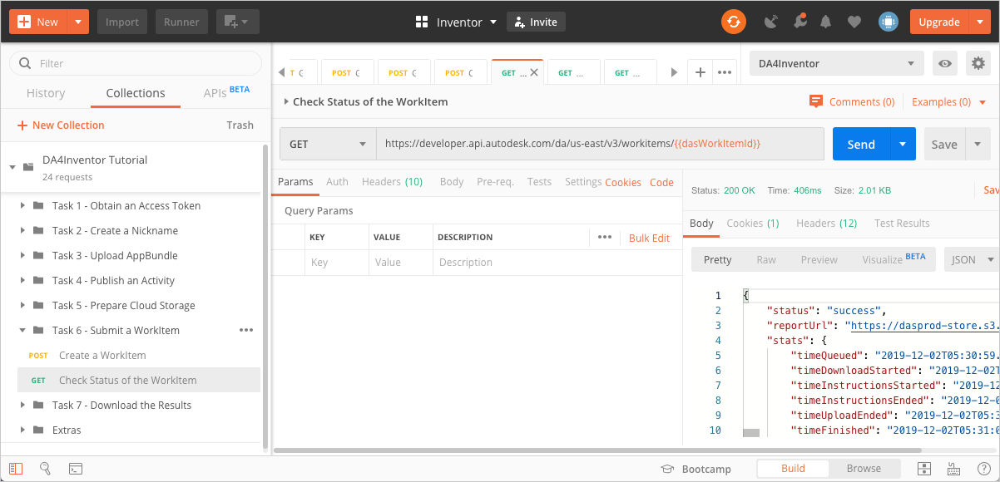

# Task 6 - Submit a WorkItem

When you submit a WorkItem to Design Automation, you are instructing Design Automation to execute the Activity specified in the WorkItem.

The relationship between an Activity and a WorkItem can be thought of as the relationship between a “function definition” and “function call”.
Named parameters of the Activity have corresponding named arguments of the WorkItem.
Like in function calls, optional parameters of the Activity can be skipped and left unspecified while posting a WorkItem.

## Create a WorkItem

1. On the Postman sidebar, click **Task 6 - Submit a WorkItem > Create a WorkItem**. The request loads.

2. Click the **Body** tab and observe how the Activity ID, the input file, and the output file are specified.

3. Click **Send**. If the request is successful you should see a screen similar to the following image.

    

    The main attributes on the JSON payload are:

    - `activityId` - Specifies what Activity to execute. The id you specify here must be a fully qualified id. A fully qualified id is made up of three parts. They start with the Nickname of the Forge App (or the Client Id of the Forge App. The Nickname is followed by the '.' character, which in turn is followed by the Activity name. This is followed by the '+' character and finally the Activity Alias. For more information on fully qualified ids and unqualified ids, see the [Forge portal documentation on ids](https://forge.autodesk.com/en/docs/design-automation/v3/developers_guide/aliases-and-ids/#ids).

    - `arguments` - Contains all the parameters that need to be passed to the Activity specified by `activityId`. They must match the parameters you specified in Task 4, when you created the Activity.

    - `InventorDoc` - Specifies how to obtain the input Inventor part file for the Activity. The value specified here is the Postman variable `ossInputFileSignedUrl`, which contains the signed download URL you created in Task 5. 
    
    **Note** Had you uploaded a zip file instead of a IPT file, you would have been required specify the `pathInZip` attribute. This attribute specifies the path to the IPT file within the zip file. 

    - `InventorParams` - Specifies the new height and width of the Inventor part file, as a JSON object.

    - `OutputIpt` - Specifies the signed URL to the location on cloud storage reserved for the resized part file. The value specified here is the Postman variable `ossOutputIptFileSignedUrl`, which contains the signed URL you created for the resized part in Task 5. 

    - `OutputBmp` - Specifies the signed URL to the location on cloud storage reserved for the generated image file. The value specified here is the Postman variable `ossOutputBmpFileSignedUrl`, which contains the signed URL you created for the image file in Task 5. 

## Check Status of a WorkItem

Design Automation WorkItems are queued before they are processed. Processing itself can take time. Once processing is done, you need to know if the WorkItems ran successfully or not. As such it is important for you to check the status of the WorkItem you created.

1. On the Postman sidebar, click **Task 7 - Submit a WorkItem > Check Status of a WorkItem**. The request loads.

2. Click **Send**. You should see a screen similar to the following image.

    

**Note:** The best practice is to use the `onComplete` argument when submitting a WorkItem. The `onComplete` argument enables you to specify a callback URL, which is invoked when execution completes. For more information on the argument, see the [Forge portal documentation on Callbacks](https://forge.autodesk.com/en/docs/design-automation/v3/developers_guide/callbacks/#oncomplete-callback).

[:rewind:](../readme.md "readme.md") [:arrow_backward:](task-5.md "Previous task") [:arrow_forward:](task-7.md "Next task") 
