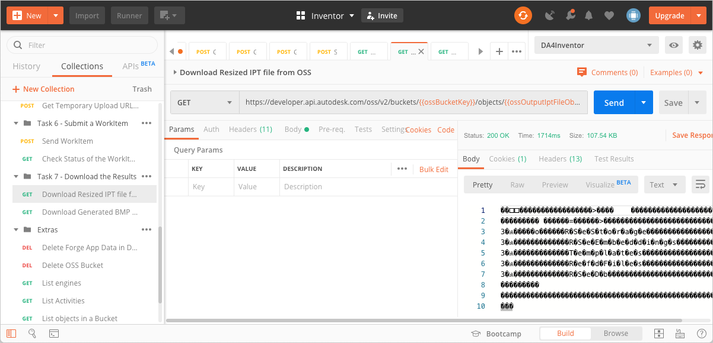
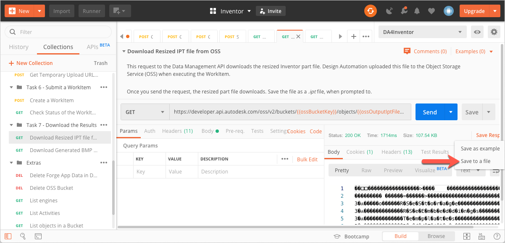
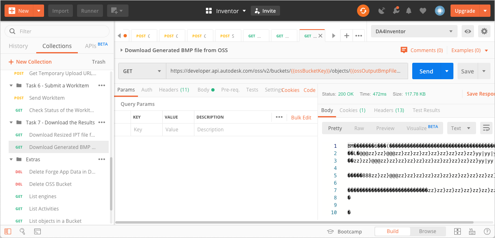
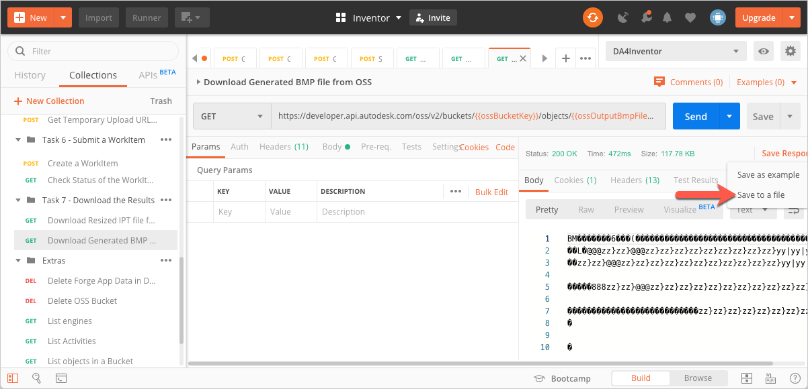

# Task 7 - Download the results

Once the WorkItem has completed executing the Activity, Design Automation uploads the resulting files to OSS. You use the Forge Data Management API to download the text file to your local machine.

## Download the resized IPT file from OSS

1. On the Postman sidebar, click **Task 7 - Download the Results > GET Download Resized IPT file from OSS**. The request loads.

2. Click **Send**. You should see a screen similar to the following image.

    

3. In the response area, click **Save Response > Save to a file**. The output file downloads. Save the file as a *.ipt* file.

    

## Download the generated BMP file from OSS

1. On the Postman sidebar, click **Task 7 - Download the Results > GET Download Generated BMP file from OSS**. The request loads.

2. Click **Send**. You should see a screen similar to the following image.

    

3. In the response area, click **Save Response > Save to a file**. The output file downloads. Save the file as a *.ipt* file.

    