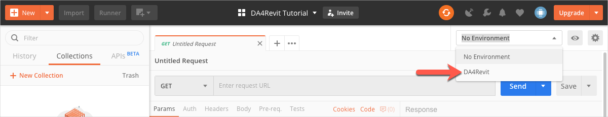

# Before you Begin...

## 1. Import the Environment for the Tutorial

1. Download the file *DA4Revit-Environment.postman_environment.json* from the [*collections* folder of this repository](../collections).

2. Import *DA4Revit-Environment.postman_environment.json*

    1. In the Postman header bar, click **Import**. A dialog displays.

    2. Drag the file you downloaded in step 1 to the area marked **Drop files here**.

3. Click the **Environment drop-down** on the upper-right, and select **DA4Revit**. The DA4Revitenvironment loads.
   

## 2. Import the Postman Collection for the Tutorial.

1. Download the file *DA4Revit-Collection.postman_collection.json* from  the [*collections*  folder of this repository](https://git.autodesk.com/ASRD-CPUX/Postman_Collections/tree/master/DA4Revit/collections).

2. Import *DA4Revit-Collection.postman_collection.json*

    1. In the Postman header bar, click **Import**. A dialog displays.

    2. Drag the file you downloaded in step 1 to the area marked **Drop files here**.

## 3. Get a Revit Add-in that is Design Automation Ready 

- On the Forge portal, follow the instructions in the topic [Convert Revit Add-in Task](https://dev.forge.autodesk.com/en/docs/design-automation/v3/tutorials/revit-edit/step1-convert-addin/?sha=6120_10).

or

- Download the Design Automation ready add-in, *DeleteWalls.dll* from [here](/en/docs/design-automation/v3/tutorial_data/DeleteWalls-dll.zip)

