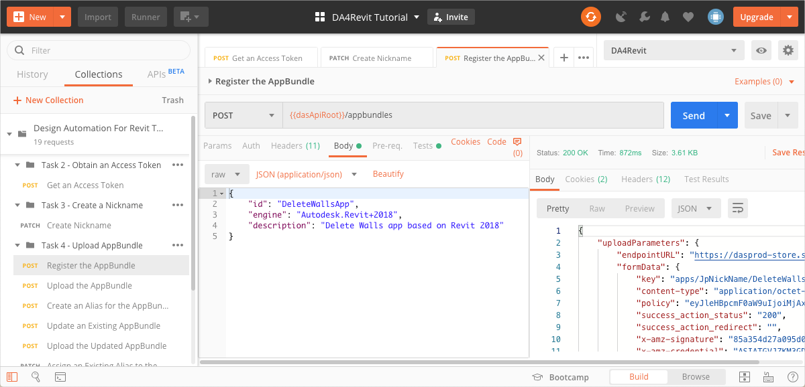
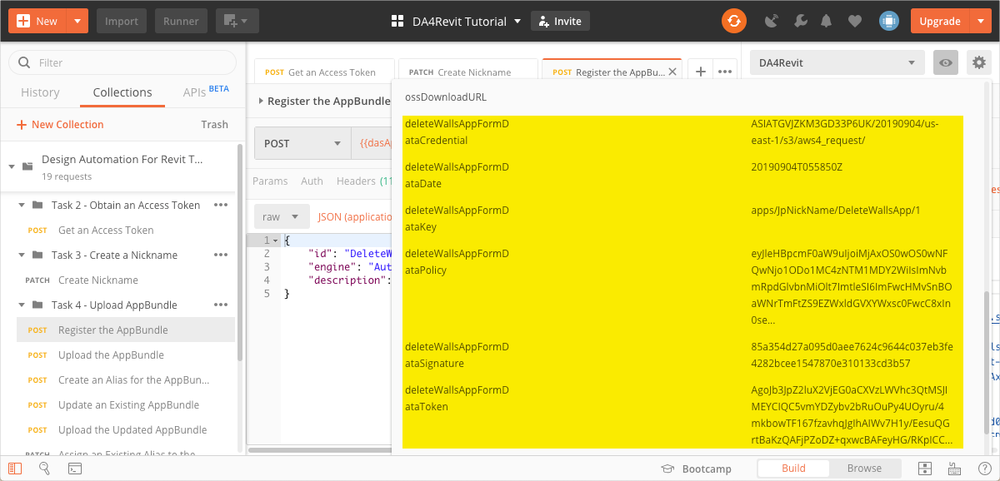
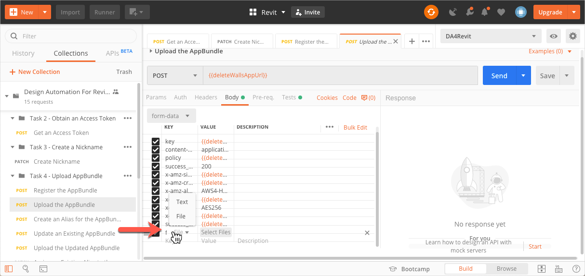
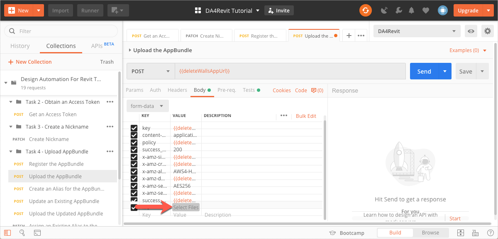
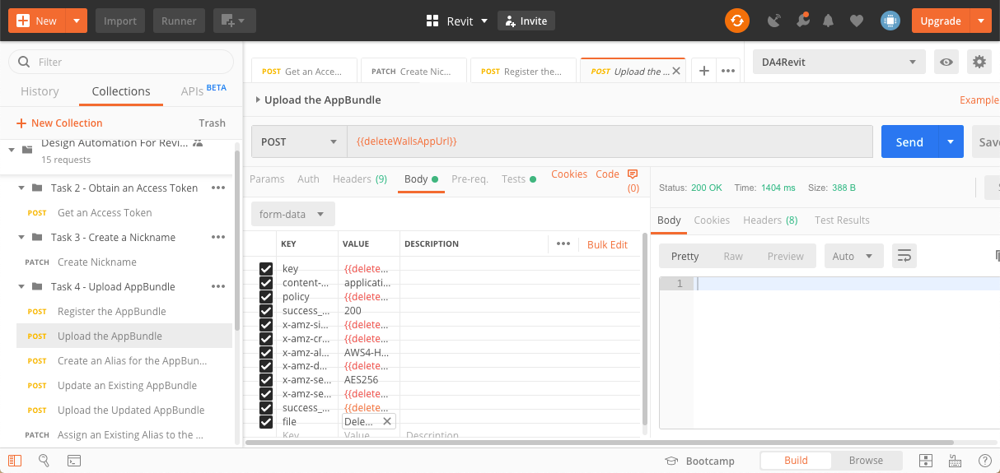
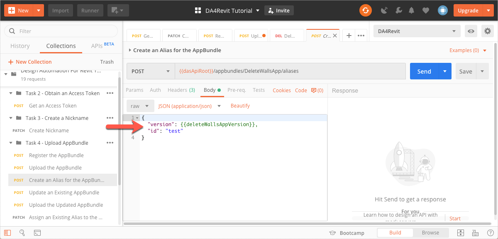
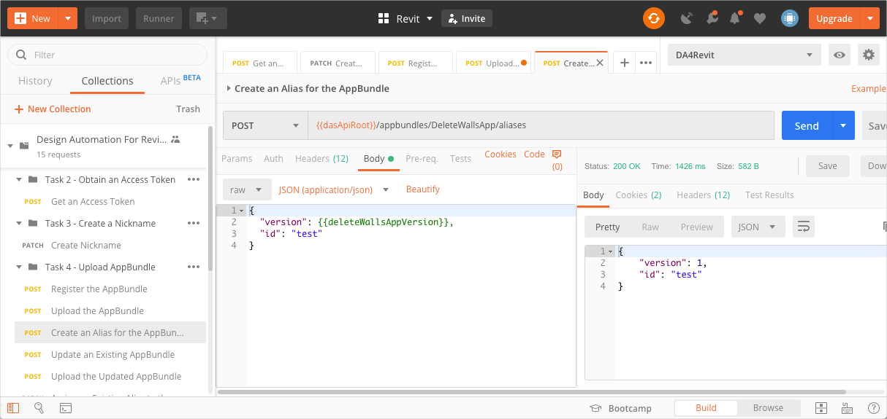
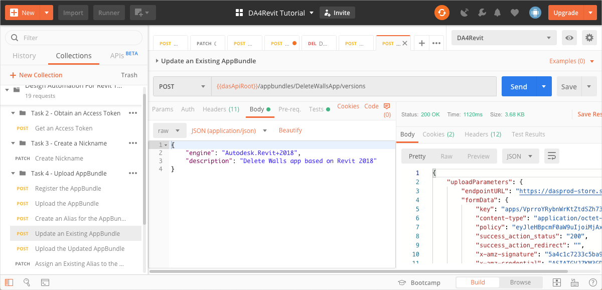

# Task 4 - Upload an AppBundle to Design Automation

An AppBundle is a package of binaries and supporting files that make up a Revit add-in. See the corresponding [task in the Step-by-Step tutorial on the Forge Portal](https://dev.forge.autodesk.com/en/docs/design-automation/v3/tutorials/revit-edit/step4-publish-appbundle/?sha=6201_3) for an explanantion of AppBundles and learn how to create an AppBundle. For the purpose of this Postman tutorial,  download *DeletWallsApp.zip*, which is stored in the [*tutorial_data* folder of this repository](../tutorial_data). The file *DeleteWalls.dll* that is contained within this AppBundle is designed to run on Revit 2018.

## Register the AppBundle

When registering the AppBundle, you inform Design Automation that you want to name it DeleteWallsApp, and that it must run on Revit 2018.

1. On the Postman sidebar, click **Task 4 - Upload AppBundle > POST Register the AppBundle**. The request loads.

2. Click the **Body** tab, and verify that the `id`, and `engine` are set to `DeleteWallsApp`, and `Autodesk.Revit+2018`.

     

3. Click **Send**. If the request is successfull, you will see a screen similar to the following image:

    

    The `endpointURL` and `formData` information required to upload the AppBundle is saved to Postman Environment variables.

    

## Upload the AppBundle

1. On the Postman sidebar, click **Task 4 - Upload AppBundle > POST Upload the AppBundle**. The request loads.

2. Click the **Body** tab, and scroll down such that the **file** row is visible.

3. Move the cursor to the **VALUE** column on the **file** row, and close the box shown in the following image. 

    

4. Click **Select Files**, and pick *DeletWallsApp.zip*, which you downloaded earlier.

    

5. Click **Send**. You should see a screen similar to the following. Note that the response has only a header and no body.

    

## Create an Alias for the AppBundle

When you registered the AppBundle earlier, it was registered as version 1 of the AppBundle. Now, you create an alias named test to reference that version.

1. On the Postman sidebar, click **Task 4 - Upload AppBundle > POST Create an Alias for the AppBundle**. The request loads.

2. Click the **Body** tab. and note how `id` is set to`test`.

    

3. Click **Send**. You should see a response similar to the following image.

    

## Update an Existing AppBundle

To update an existing AppBundle, you must register a new version of the AppBundle and then upload the updated AppBundle for that version. If you try to overwrite an existing AppBundle, Design Automation for Revit throws a `409 Conflict` error.

To register a new version:

1. On the Postman sidebar, click **Task 4 - Upload AppBundle > POST Update an Existing AppBundle**. The request loads.

2. Click the **Body** tab. Note that you are now specifying only the engine and description.

3. Click **Send**. You should see a response similar to the following image. As with registering an AppBundle, the `endpointURL` and `formData` information required to upload the AppBundle is saved to Postman Environment variables.

    

## Upload the updated AppBundle

1. On the Postman sidebar, click **Task 4 - Upload AppBundle > POST Upload the Updated AppBundle**. The request loads.

2. Click the **Body** tab, and scroll down such that the **file** row is visible.

3. Move the cursor to the **VALUE** column on the **file** row, and close the box there. The *Select Files** button displays.

4. Click **Select Files**, and pick *DeletWallsApp.zip*, which you downloaded earlier.

5. Click **Send**.

## Assign the Alias you specified earlier to the updated AppBundle

1. On the Postman sidebar, click **Task 4 - Upload AppBundle > PATCH Assign an Existing Alias to the Updated AppBundle**. The request loads.

2. Click the **Body** tab. Observe how the new version is specified using a Postman Environment Variable.

3. Click **Send**.

[:rewind:](../readme.md "readme.md") [:arrow_backward:](task-3.md "Previous task") [:arrow_forward:](task-5.md "Next task")
