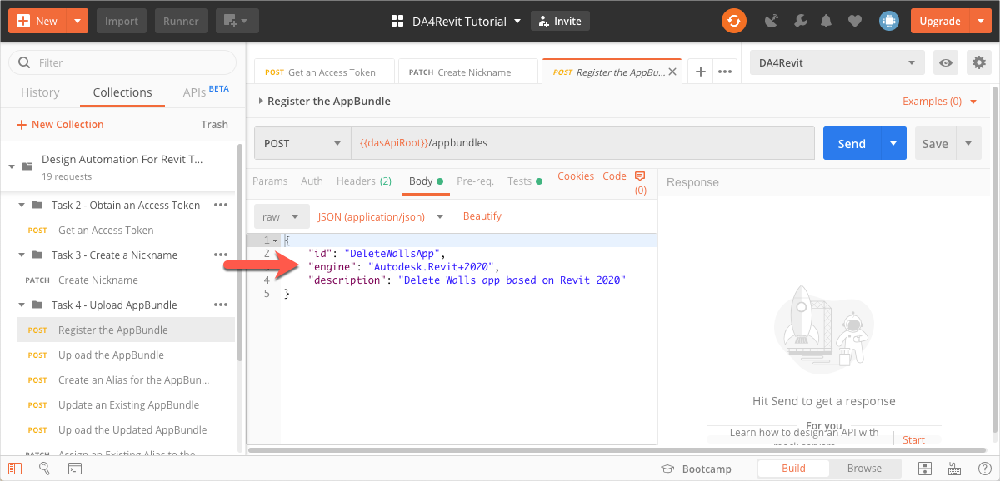

# Task 4 - Upload an AppBundle to Design Automation

An AppBundle is a package of binaries and supporting files that make up a Revit add-in. See the corresponding task in the Step-by-Step tutorial on the Forge Portal for an explanantion of AppBundles and information on how to put an AppBudle together. For the purpose of this Postman tutorial, you download *DeletWallsApp.zip*, which is stored in the *tutorial_data* folder of this repository. The file *DeleteWalls.dll* that is contained within this AppBundle is designed to run on Revit 2018.

## Register the AppBundle

When registering the AppBundle, you inform Design Automation that you want to name it DeleteWallsApp, and that it must run on Revit 2018.

1. On the Postman sidebar, click **Task 4 - Upload AppBundle > POST Register the APpBundle**. The request loads.

2, Click the **Body** tab, and verify that the `id`, and `engine` are set to `DeleteWallsApp`, and `Autodesk.Revit+2018`.
 

## Upload the AppBundle

[:arrow_backward:](task-2.md)  [:arrow_up_small:](../readme.md)  [:arrow_forward:](task-4.md)