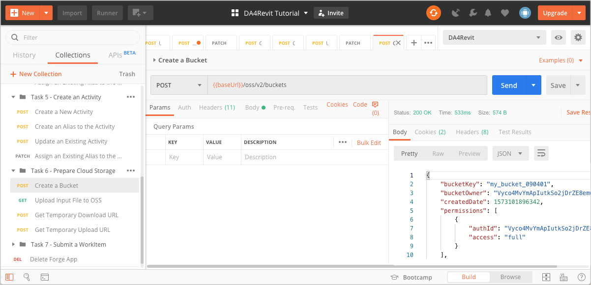
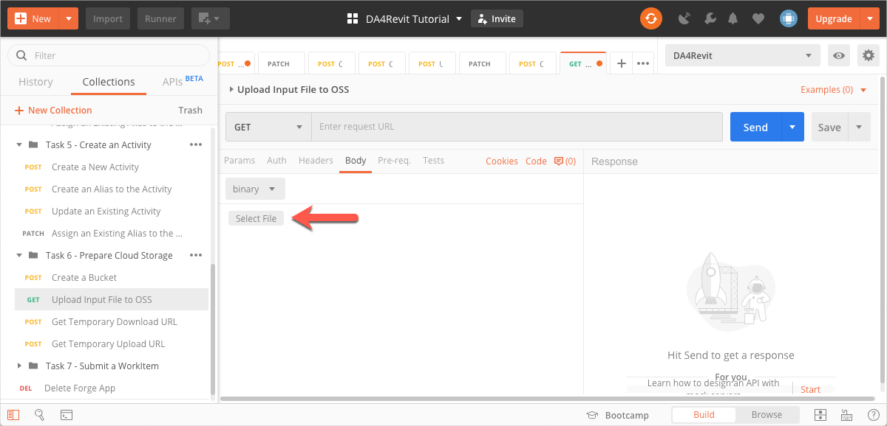
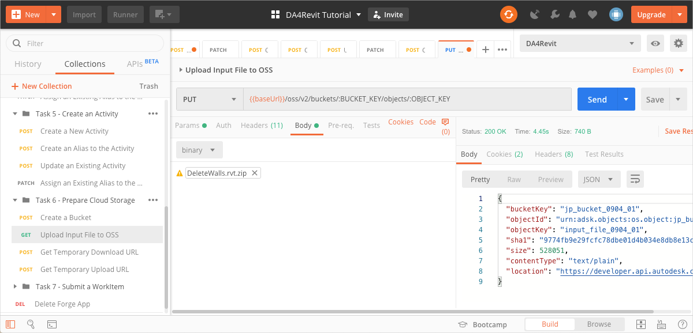
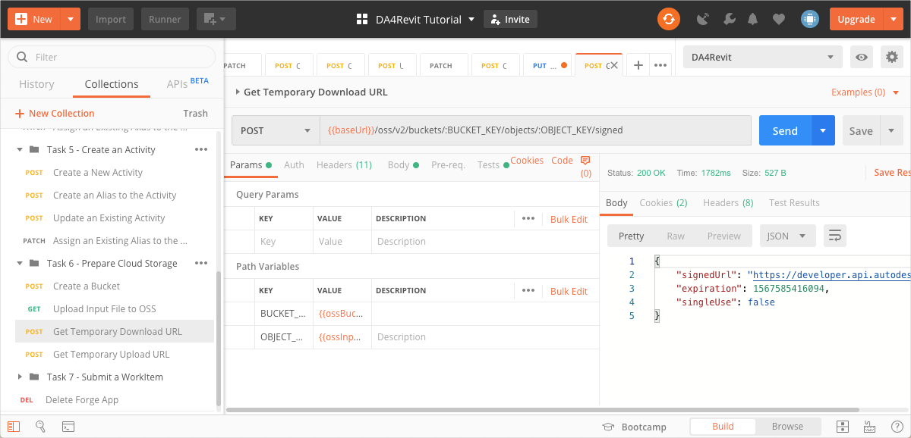

# Prepare cloud storage

The DeleteWalls add-in takes a Revit file as an input and produces another Revit file as output. In this task we prepare the cloud storage (OSS) to hold these files.

There are three Postman Environment Variables you must specify for this task. They are 
- `ossBucketKey` - The object key for the Bucket that holds your files in the cloud.
- `ossInputFileObjectKey` - The object key of the Revit file for use as input.
- `ossOutputFileObjectKey` - The object key of the placeholder for the output file that the add-in produces.

## Create a Bucket

1. Click the **Environment quick look** icon on the upper right corner of Postman. 

2. In the **CURRENT VALUE** column, in the **ossBucketKey** row, specify a name the Bucket that stores your files.

    **Notes** 
    - The bucket name needs to be unique throughout the OSS service. At the time you create a bucket, you may need to change the value of this variable if a bucket with the name you specified already exists. 
    - The bucket name must consist of only lower case caharcters, numbers 0-9, and the underscore (_) character.

3. Click the **Environment quick look** icon to hide the variables.

4. On the Postman sidebar, click **Task 6 - Prepare Cloud Storage > POST Create a Bucket**. The request loads.

5. Click **Send**. If the request is successfull, you should see a screen similar to the following image.

    

## Upload input file to OSS

1. Download the input file, *DeleteWalls.rvt*  from the [*tutorial_data* folder of this repository](https://git.autodesk.com/ASRD-CPUX/Postman_Collections/tree/master/DA4Revit/tutorial_data) and zip it up.

2. Click the **Environment quick look** icon on the upper right corner of Postman. 

3. In the **CURRENT VALUE** column, in the **ossInputFileObjectKey** row, specify an Object Key (a name to identify the input file, once it is uploaded to OSS).

4. Click the **Environment quick look** icon to hide the variables.

5. On the Postman sidebar, click **Task 6 - Prepare Cloud Storage > PUT Upload Input File**. The request loads.

6. Click the **Body** tab.

7. In the **Data Type** drop-down, select **binary**.

    

8. Click **Select File** and pick the zip file you created in step 1.

    

9. Click **Send**. If your request is successful, you should see a screen similar to the one below:

    

## Get temporary download URL

Design Automation needs to download the input file in order to preocess it. This request obtains a temporary signed URL that Design Automation can use to download the file, and saves it to a Postman Environment Variable.

1. On the Postman sidebar, click **Task 6 - Prepare Cloud Storage > GET Temporary Download URL**. The request loads.

2. Click **Send**. If the request is successful, you should see a screen similar to the following image. Furthermore, the signed URL is saved to the `ossDownloadURL` Postman Environment Variable.

    

## Get temporary upload URL

Design Automation needs a signed URL to upload the output that the DeleteWalls add-in creates. This request obtains a temporary signed URL that Design Automation can use to upload the file, and saves it to a Postman Environment Variable.

1. Click the **Environment quick look** icon on the upper right corner of Postman. 

2. In the **CURRENT VALUE** column, in the **ossOutputFileObjectKey** row, specify an Object Key (a name to identify the output file, once it is uploaded to OSS).

3. Click the **Environment quick look** icon to hide the variables.

4. On the Postman sidebar, click **Task 6 - Prepare Cloud Storage > GET Temporary Upload URL**. The request loads.

5. Click **Send**. If the request is successful, you should see a screen similar to the following image. Furthermore, the signed URL is saved to the `ossUploadURL` Postman Environment Variable.

    

[:arrow_backward:](task-4.md)  [:arrow_up_small:](../readme.md)  [:arrow_forward:](task-6.md)

