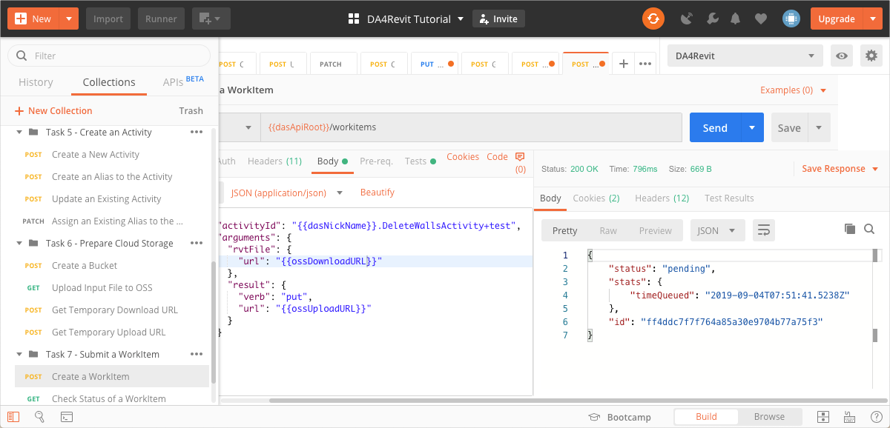
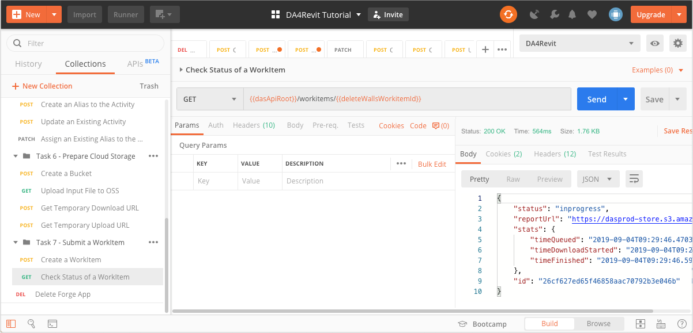

# Task 7 - Submit a WorkItem

When you submit a WorkItem to Design Automation, you are instructing Design Automation to execute the Activity specified in the WorkItem.

The relationship between an Activity and a WorkItem can be thought of as a “function definition” and “function call”, respectively.
Named parameters of the Activity have corresponding named arguments of the WorkItem.
Like in function calls, optional parameters of the Activity can be skipped and left unspecified while posting a WorkItem.

For this exercise, you will apply the DeleteWalls Activity on the Revit file you uploaded to OSS in the previous task. The request picks up the Revit file from the signed url stored in the variable 'ossDownloadURL'. 

## Create a WorkItem

1. On the Postman sidebar, click **Task 7 - Submit a WorkItem > Create a WorkItem**. The request loads.

2. Click the **Body** tab and observe how the Actvity ID, the input file, and the ouput file are specified.

3. Click **Send**. If the request is successfull you should see a screen similar to the following image.

    

## Check Status of a WorkItem

Design Automation WorkItems are queued before they are processed. Processing itself can take time. Once processing is done, you need to know if the WorkItems ran successfully or not. As such it is important for you to check the status of the WorkItem you created.

1. On the Postman sidebar, click **Task 7 - Submit a WorkItem > Check Status of a WorkItem**. The request loads.

2. Click **Send**. You should see a screen similar to the following image.

    

[:rewind:](../readme.md "readme.md") [:arrow_backward:](task-6.md "Previous task") 
