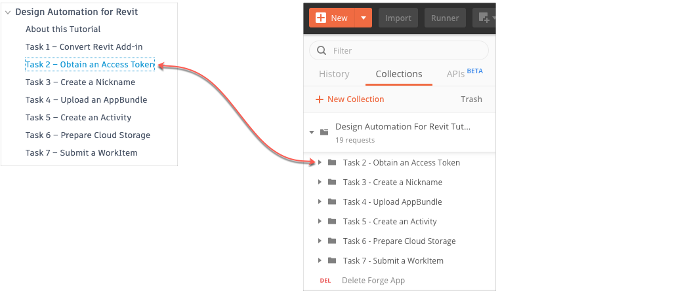
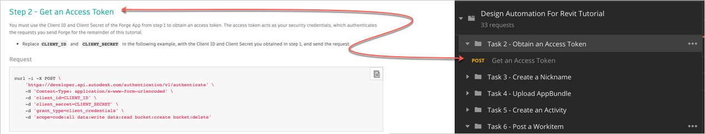

# Design Automation for Revit Step-by-Step Tutorial

This folder contains a Postman Collection that contains the requests used in the [Design Automation for Revit Step-by-Step tutorial](https://dev.forge.autodesk.com/en/docs/design-automation/v3/tutorials/revit-edit/?sha=6120_10) on the Forge Portal. 

On the Postman sidebar, requests are stored in folders that have the same name as the corresponding task in the Forge portal.

Individual requests in Postman have the same names as the correspondong step in the Forge portal.

Instructions to run the Postman tutorial are as below:

- [Before you begin](instructions/before_you_begin.md)
- [Task 2 - Obtain an Access Token](instructions/task-2.md)
- [Task 3 - Create a Nickname](instructions/task-3.md)
- [Task 4 - Upload an AppBundle to Design Automation](instructions/task-4.md)
- [Task 5 - Create an Activity](instructions/task-5.md)
- [Task 6 - Prepare cloud storage](instructions/task-6.md)
- [Task 7 - Submit a WorkItem](instructions/task-7.md)

