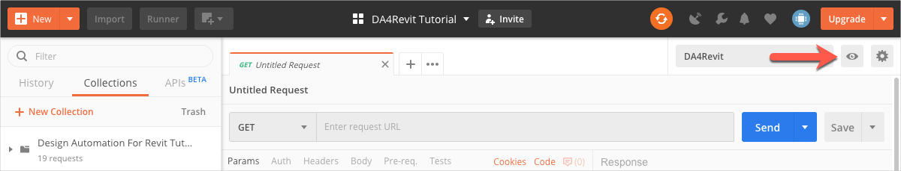
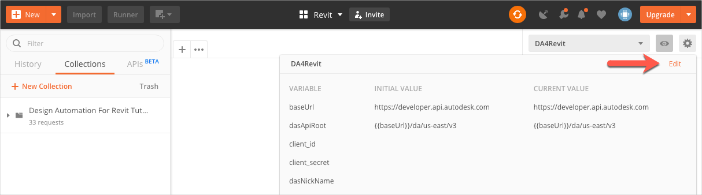
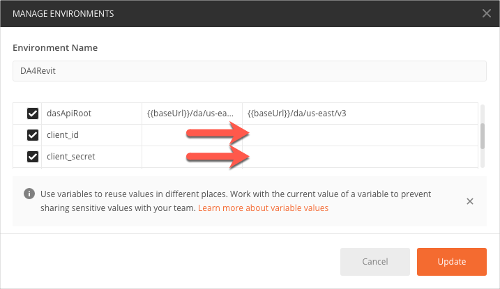
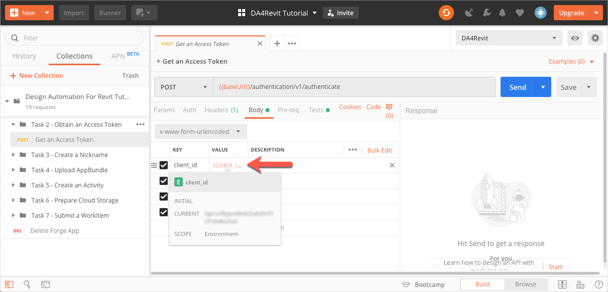

# Design Automation for Revit Step-by-Step Tutorial

This folder contains a Postman Collection that contains the requests used in the [Design Automation for Revit Step-by-Step tutorial](https://dev.forge.autodesk.com/en/docs/design-automation/v3/tutorials/revit-edit/?sha=6120_10) on the Forge Portal. 

On the Postman sidebar, requests are stored in folders that have the same name as the corresponding task in the Forge portal.

Individual requests in Postman have the same names as the correspondong step in the Forge portal.

Topics:

- [Before you begin](before_you_begin.md)

## Before you Begin...

### 1. Import the Environment for the Tutorial

1. Download the file *DA4Revit-Environment.postman_environment.json* from the [*collections*](https://git.autodesk.com/ASRD-CPUX/Postman_Collections/tree/master/DA4Revit/collections) folder of this repository.

2. Import *DA4Revit-Environment.postman_environment.json*

    1. In the Postman header bar, click **Import**. A dialog displays.

    2. Drag the file you downloaded in step 1 to the area marked **Drop files here**.

3. Click the **Environment drop-down** on the upper-right, and select **DA4Revit**. The das-prd environment loads.
   

### 2. Import the Postman Collection for the Tutorial.

1. Download the file *DA4Revit-Collection.postman_collection.json* from  the [*collections*](https://git.autodesk.com/ASRD-CPUX/Postman_Collections/tree/master/DA4Revit/collections) folder of this repository.

2. Import *DA4Revit-Collection.postman_collection.json*

    1. In the Postman header bar, click **Import**. A dialog displays.

    2. Drag the file you downloaded in step 1 to the area marked **Drop files here**.

### 3. Get a Revit Add-in that is Design Automation Ready 

- On the Forge portal, follow the instructions in the topic [Convert Revit Add-in Task](https://dev.forge.autodesk.com/en/docs/design-automation/v3/tutorials/revit-edit/step1-convert-addin/?sha=6120_10).

or

- Download the Design Automation ready add-in, *DeleteWalls.dll* from [here](/en/docs/design-automation/v3/tutorial_data/DeleteWalls-dll.zip)

## Task 2 - Obtain an Access Token

### Create a Forge App

1. Follow the instructions on [Get Started with Forge in Three Steps](https://dev.forge.autodesk.com/developer/start-now/signup) 
to create a Forge App. In the *Add Services to Forge* stage, select  "Design Automation API V3 (Beta)" and "Data Management API".

2. Jot down the Client ID and Client Secret of the Forge App you created.

### Save Client ID and Client Secret to Postman Environment Variables

In the das-prd environment that you selected earlier, there are two Postman Environment Variables named `client_id` and `client_secret`. By setting these variables to the values of the Client ID and Client Secret you jotted down, you can save yourself the trouble of specifying them when you send HTTP requests to Forge. 

To set the environment variables:

1. Click the **Environment quick look** icon on the upper right corner of Postman. 
   

2. Click **Edit** on the upper right corner. The Manage Environments dialog displays.
   

3. In the **CURRENT VALUE** column, enter the values of the Client ID and Client Secret you jotted down earlier.
    

4. Click **Update**.

### Get an Access Token

To get an Access Token, you must send an `authenticate` request to Forge. The Postman collection has a pre-populated authenticate request that you can send. To send the request to Forge:

1. On the Postman sidebar click **Task 2 - Obtain an Access Token > POST Get an Access Token**. The request loads.

2. Click the **Body** tab.

3. Move the cursor over the **Value** column of the **client_id** and **client_secret**, and verify that the values you specified as environment variables are displayed.
    

4. Click **Send**. The request is sent to Forge. If your request authenticates successfully, you should see a response similar to the following:
 

Postman saves the Access Token in the Postman Environment Variable `dasApiToken`. Postman picks up the Access Token from this variable for all subsequent requests, eliminating the need for you to repeatedly specify the value of the token.

