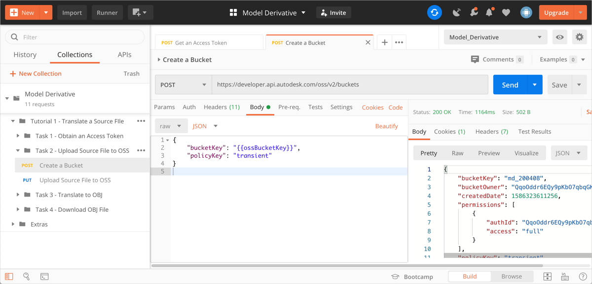
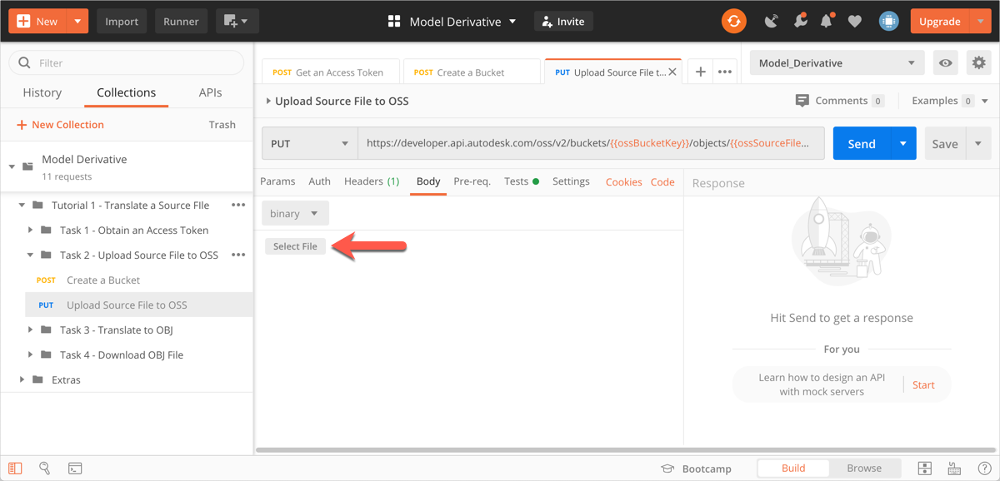
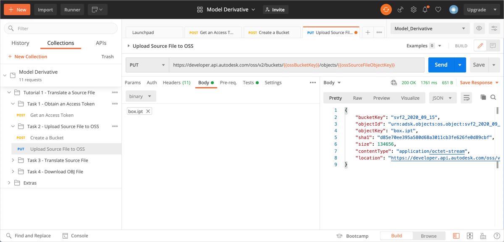

# Task 2 - Upload Source File to OSS

The Object Storage Service (OSS) is a generic Cloud Storage Service that is part of the Forge Data Management API. In this task, you upload the model to translate to OSS. While you can use any model for this purpose, we recommend that you use the file *box.ipt*, which is available in the [*tutorial_data*](../tutorial_data) folder.

## Create a Bucket

In this tutorial, you will use a Postman environment variable named `ossBucketKey` to hold the Object Key of the Bucket that contains your files in the cloud. If you already have a bucket (from a previous tutorial), carry out step 1, and ignore the rest.

1. Specify a value for the Bucket Key in the Postman Environment Variable named `ossBucketKey`:

    1. Click the **Environment quick look** icon (the eye icon) on the upper right corner of Postman.

    2. In the **CURRENT VALUE** column, in the **ossBucketKey** row, specify a name for the Bucket that stores your files.

        **Notes:**  
        - The Bucket name needs to be unique throughout the OSS service. if a Bucket with the name you specified already exists, the system will return a `409` conflict error in step 5. If you recieve this error, change the value of this variable and try again.

        - The Bucket name must consist of only lower-case characters, numbers 0-9, and the underscore (_) character.

    3. Click the **Environment quick look** icon to hide the variables.

4. In the Postman sidebar, click **Task 2 - Upload Source File to OSS > POST Create a Bucket**. The request loads.

5. Click the **Body** tab, and verify that the `bucketkey` attribute has been set to the variable `ossBucketKey`.

5. Click **Send**. If the request is successful, you should see a screen similar to the following image.

    
    
## Obtain Signed URL

1. Use the following GET HTTP request to obtain the signed URL. https://developer.api.autodesk.com/oss/v2/buckets//objects//signeds3upload?minutesExpiration=
   i. 

2. Provide an Access token Authorization in Headers.

3. Define URI Parameters for Bucket key, Object key, and Upload key.

Note the use of `ossBucketkey` and `ossSourceFileObjectKey` as URI parameters.

4. Define minutes expiration in Query parameters.

5. Click the **Body** tab.

6. Click **Send**. This sends the request, and updates the following Postman environment variables:

   | Variable Name              | Description                                                                                 |
   |----------------------------|---------------------------------------------------------------------------------------------|
   | t1_ossSourceFileObjectKey  | Object Key of the source file. Should be `box.ipt`.                                         |
   | t1_ossSourceFileURN        | Value of the `objectId` attribute in the JSON response. This is the URN of the source file. |
   | t1_ossEncodedSourceFileURN | The URN of the source file, converted to a Base64-encoded URN.            
   | UploadKey | The URN to upload the file. 
   You should see a screen similar to the following image:
   
## Upload the file

1. Download the file *box.ipt* from the [*tutorial_data* folder of this tutorial](../tutorial_data).

2. Note the use of `ossBucketkey` and `ossSourceFileObjectKey` as URI parameters.

3. 

3. Click **Send** to upload the file
You should see a screen similar to the following image:

## Finalize Upload

1. Use the following POST HTTP request to obtain the signed URL.
https://developer.api.autodesk.com/oss/v2/buckets/{{ossBucketKey}}/objects/{{ossSourceFileObjectKey}}/signeds3upload

2. Define URI Parameters for Bucket key, Object key, and Upload key.

3. Click the **Body** tab, and verify that the `uploadKey` attribute has been set to the variable `UploadKey`.

4. Click **Send** to finalize the upload.
You should see a screen similar to the following image:

## Upload source file to OSS

1. Download the file *box.ipt* from the [*tutorial_data* folder of this tutorial](../tutorial_data).

2. Set the Postman environment variable `ossSourceFileObjectKey` to `box.ipt`, which you will use as the Object Key for the file you downloaded in the previous step. 

   1. Click the **Environment quick look** icon (the eye icon) on the upper right corner of Postman.

   2. In the **CURRENT VALUE** column, in the **ossSourceFileObjectKey** row, specify `box.ipt` as the value for that variable. 

   3. Click the **Environment quick look** icon to hide the variables.

2. In the Postman sidebar, click **Task 2 - Upload Source File to OSS > PUT Upload Source File to OSS**. The request loads.

    Note the use of `ossBucketkey` and `ossSourceFileObjectKey` as URI parameters.

3. Click the **Body** tab.

4. Click **Select File** and select the file *box.ipt*, which you downloaded in step 1.

    

5. Click **Send**. This sends the request, and updates the following Postman environment variables:

   | Variable Name              | Description                                                                                 |
   |----------------------------|---------------------------------------------------------------------------------------------|
   | t1_ossSourceFileObjectKey  | Object Key of the source file. Should be `box.ipt`.                                         |
   | t1_ossSourceFileURN        | Value of the `objectId` attribute in the JSON response. This is the URN of the source file. |
   | t1_ossEncodedSourceFileURN | The URN of the source file, converted to a Base64-encoded URN.                              |

   You should see a screen similar to the following image:

    

[:rewind:](../readme.md "readme.md") [:arrow_backward:](task-1.md "Previous task") [:arrow_forward:](task-3.md "Next task")
