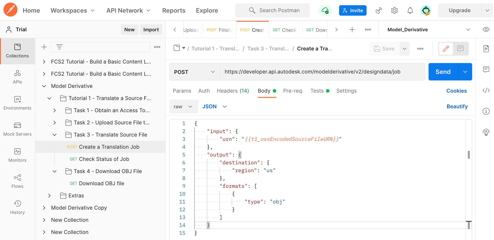
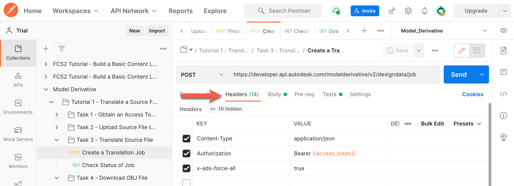
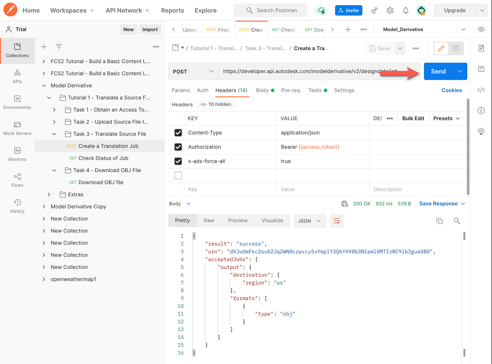
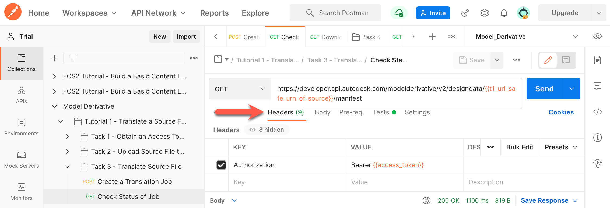
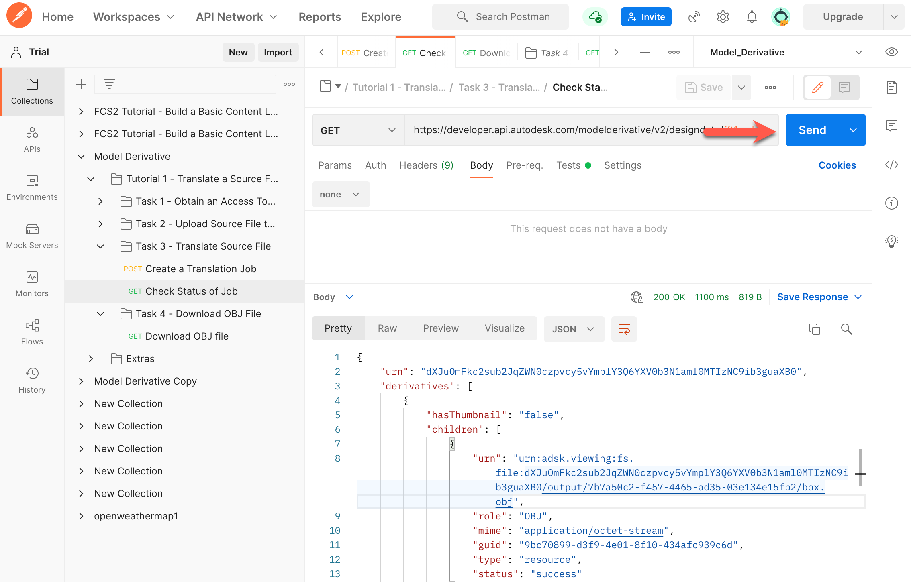

# Task 3 – Translate Source File

You can translate the source file to many different formats (see [Supported Translations](https://forge.autodesk.com/en/docs/model-derivative/v2/developers_guide/supported-translations/) for details). For the purpose of this tutorial, you will translate the source file to the OBJ format.

To translate a file, you must kick off a translation job. The translation job produces a manifest, which lists all the files that are generated. It also reports how far translation has progressed as a percentage, for each file listed in the manifest.

## Start a translation job

For this task, you will use the Base64-encoded URN of the source file. In the previous task, Postman saved this to the variable `t1_ossEncodedSourceFileURN`, which you will use in the next request.

1. In the Postman sidebar, click **Task 3 - Translate Source File > Create a Translation Job**. The request loads.

2. Click the **Body** tab and take note of the JSON payload.

    
    
    The main attributes on the JSON payload are:

    - `urn` - The Base64-encoded URN of the source file.

    - `region` - Optional parameter that specifies the region where the translation must be stored.

    - `type` - The file type that the source file will be translated to.

3. Click the **Headers** tab and define the `Content-Type`, `Authorization`, and `x-ads-force_all` headers.

    

4. Click **Send**. If the request is successful you should see a screen similar to the following image.

    

    Note the `urn` attribute in the JSON response. This is the URL-safe Base64 encoded URN of the source file. A script in the **Tests** tab, saves this value to a variable named `t1_url_safe_urn_of_source`.

## Check status of translation job

When you kick off a translation job, it takes time to complete. There are two ways to check if the translation job is done:

- Periodically check the status of the translation job.

- Set up a webhook to notify you when the job is done.

For the purpose of this tutorial you will check the status of the translation job. For more information on webhooks, see the [documentation on Model Derivative webhook events](https://forge.autodesk.com/en/docs/webhooks/v1/reference/events/model_derivative_events)

1. In the Postman sidebar, click **Task 3 - Translate Source File > Check Status of Job**. The request loads.

2. Click the **Headers** tab and define the `Authorization` header.

   

   Note the use of the URL-safe Base64-encoded URN of the source file as a URI parameter (the `t1_url_safe_urn_of_source` variable)

3. Click **Send**. You will see a screen similar to the following image.

   

   When a job is complete, the `progress` attribute becomes `complete`. Repeat this step until the job is complete.

   Notice that the translation job has produced two derivatives; an OBJ file and an MTL file. For this tutorial we are only interested in the OBJ file. The MTL file is an auxiliary file containing material definitions, which can be accessed by the OBJ file. If the source file contained textures, you would have seen a third child in the list of derivatives.

   A script in the **Tests** tab, saves the URN of the OBJ file to a variable named `dv_urn_0`.

[:rewind:](../readme.md "readme.md") [:arrow_backward:](task-2.md "Previous task") [:arrow_forward:](task-4.md "Next task")
