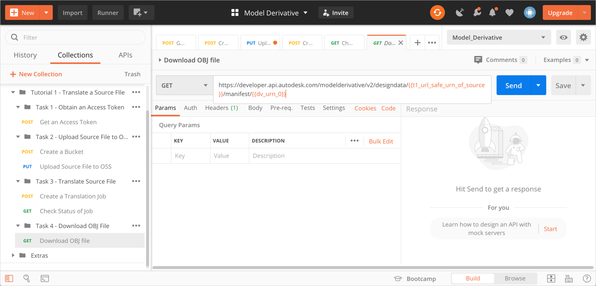
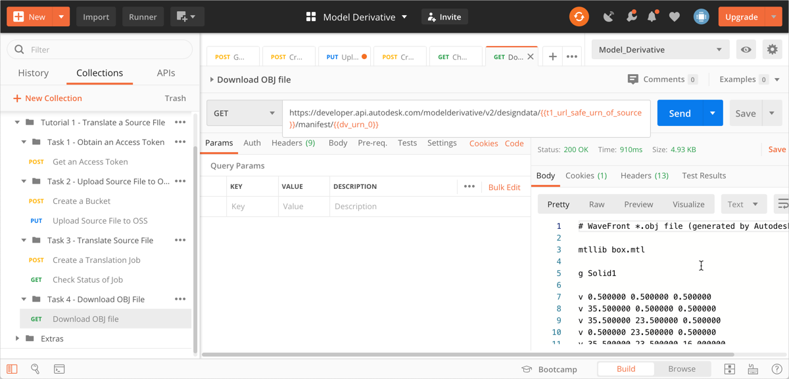
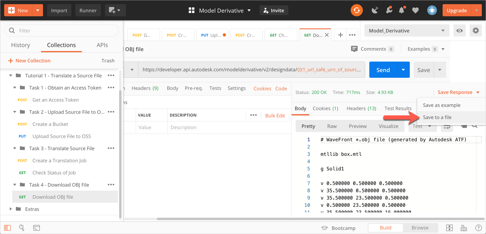

# Task 4 - Download the OBJ file

Before you download the OBJ file you must make sure that the translation job is complete. In the previous task you captured the URN of the OBJ file that was generated in a variable named `dv_urn_0`

## Download the OBJ file.

1. In the Postman sidebar, click **Task 4 - Download OBJ File > GET Download OBJ File**. The request loads.

    

    Note the use of the variables `t1_url_safe_urn_of_source` and `dv_urn_0` as URI parameters.

2. Click **Send**. You should see a screen similar to the following image.

    

3. In the response area, click **Save Response > Save to a file**. Save the file as *box.obj*, when prompted.

    

Congratulations! You have completed this tutorial.

To display the saved file:
- If you are using an Apple Macintosh, right-click *box.obj* in Finder and select **Quick View** from the menu.

- If you are using Windows, right-click *box.obj* in Windows Explorer and select **Open with > 3D Viewer** from the menu.

[:rewind:](../readme.md "readme.md") [:arrow_backward:](task-3.md "Previous task")
