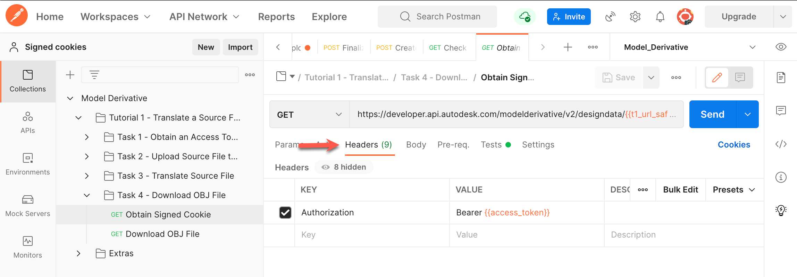

# Task 4 - Download the OBJ file

Before you download the OBJ file you must make sure that the translation job is complete. In the previous task you captured the URN of the OBJ file that was generated in a variable named `dv_urn_0`

Initially, It was possible to download the file directly. Now, as google has stopped to support binary file transfer, you need to obtain signed cookies to download the file. To obtain signed cookie:

## Obtain Signed Cookie.

1. In the Postman sidebar, click **Task 4 - Download OBJ File > GET Obtain Signed Cookie**. The request loads.

     1. Note the use of the variables t1_url_safe_urn_of_source and dv_urn_0 as URI parameters.

     2. Click the **Headers** tab. Notice that the `Authorization` header is already defined.

    

     3. Click the **Tests** tab. Notice that the `set_cookie-header` is set as environment variable.

    

     4. Click **Send**. You should see a screen similar to the following image.

    
    
     5. Click on the **Response Headers** tab. Notice that `set_cookie-header` is obtained.

    
    
 ## Download OBJ file.

As you have obtained the signed cookie, you can download the OBJ file now. To download the OBJ file:

1. In the Postman sidebar, click **Task 4 - Download OBJ File > GET Download OBJ File**. The request loads.

     1. Note the use of the variables `ContentDownloadSignedURL` as URI parameters.

     2. Click the **Headers** tab. Notice that the `Authorization` header is already defined.

    

     2. Click **Send**. You should see a screen similar to the following image. In the response area, click Save Response > Save to a file. Save the file as box.obj, when prompted.

    

Congratulations! You have completed this tutorial.

To display the saved file:

- If you are using an Apple Macintosh, right-click *box.obj* in Finder and select **Quick Look** from the menu.

- If you are using Windows, right-click *box.obj* in Windows Explorer and select **Open with > 3D Viewer** from the menu.

[:rewind:](../readme.md "readme.md") [:arrow_backward:](task-3.md "Previous task")
