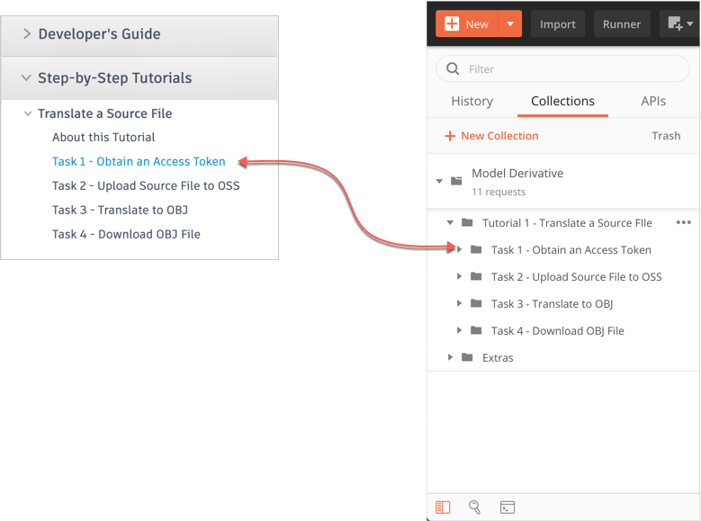
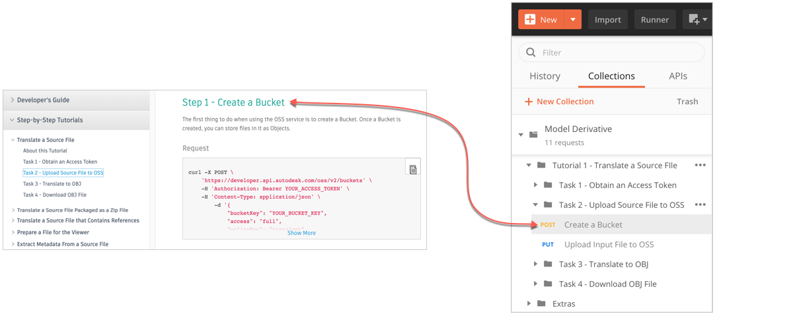

# Translate a Source File Step-by-Step Tutorial

This folder contains a Postman Collection that contains the requests used in the Model Deivative Step-by-Step Tutorial [Translate a Source File](https://forge.autodesk.com/en/docs/design-automation/v3/tutorials/3dsmax/), which is published on the Forge Portal. 

In the Postman sidebar, requests are stored in folders that have the same name as the corresponding task in the tutorial.

Individual requests in Postman have the same name as the corresponding step in the tutorial.

Instructions to run the Postman collection are as follows:

- [Before you begin](instructions/before_you_begin.md)
- [Task 1 - Obtain an Access Token](instructions/task-1.md)
- [Task 2 - Create a Nickname](instructions/task-2.md)
- [Task 3 - Publish an Activity](instructions/task-3.md)
- [Task 4 - Prepare cloud storage](instructions/task-4.md)
- [Task 5 - Submit a WorkItem](instructions/task-5.md)
- [Task 6 - Download the results](instructions/task-6.md)

