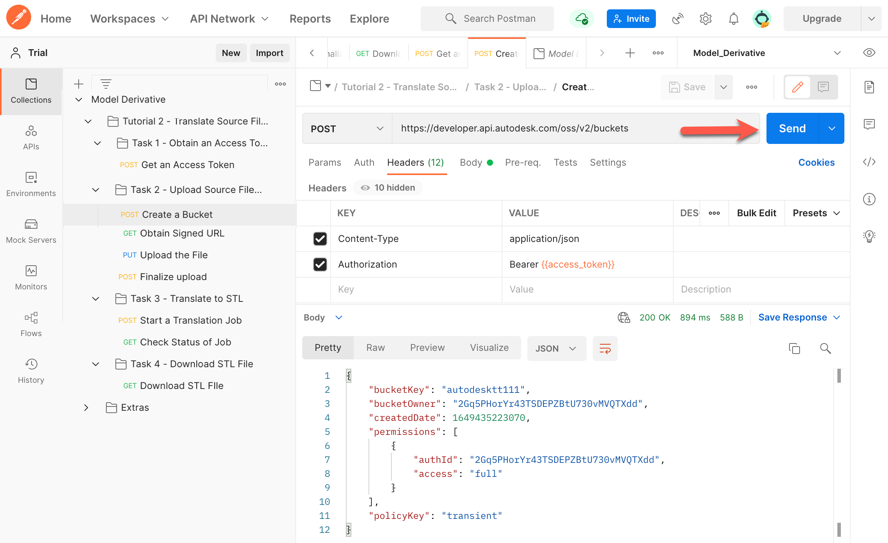
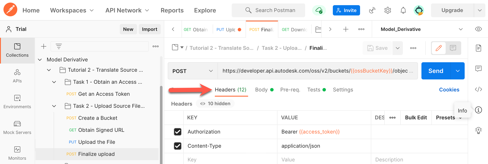
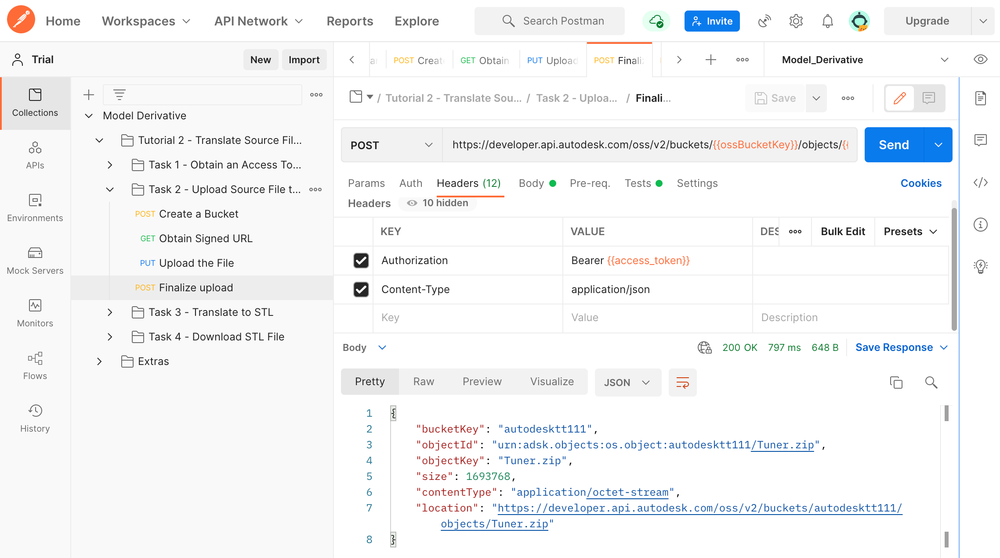

# Task 2 - Upload Source FIle to OSS

The Object Storage Service (OSS) is a generic Cloud Storage Service that is part of the Forge Data Management API. In this task, you upload a zip file containing the model to translate to OSS. While you can use any zip file containing a model, for the purpose of this tutorial we recommend that you use the file *Tuner.zip*, which is available in the [*tutorial_data*](../tutorial_data) folder.

## Create a Bucket

In this tutorial, you will use a Postman environment variable named `ossBucketKey` to hold the Object Key of the Bucket that contains your files in the cloud. If you already have a bucket (from a previous tutorial), carry out step 1, and ignore the rest.

1. Specify a value for the Bucket Key in the Postman Environment Variable named `ossBucketKey`:

    1. Click the **Environment quick look** icon (the eye icon) on the upper right corner of Postman.

    2. In the **CURRENT VALUE** column, in the **ossBucketKey** row, specify a name for the Bucket that stores your files.

        **Notes:**  
        - The Bucket name needs to be unique throughout the OSS service. if a Bucket with the name you specified already exists, the system will return a `409` conflict error in step 5. If you receive this error, change the value of this variable and try again.

        - The Bucket name must consist of only lower-case characters, numbers 0-9, and the underscore (_) character.

    3. Click the **Environment quick look** icon to hide the variables.

2. In the Postman sidebar, click **Task 2 - Upload Source File to OSS > POST Create a Bucket**. The request loads.

3. Click the **Body** tab, and verify that the `bucketkey` attribute has been set to the variable `ossBucketKey`.

4. Click **Send**. If the request is successful, you should see a screen similar to the following image.

   
    
## Obtain Signed URL

Before you upload a file to OSS, you must obtain a signed upload URL for the file. To obtain a signed upload URL:

1. In the Postman sidebar, click **Task 2 - Upload Source File to OSS > GET Obtain Signed URL**. The request loads.

   Note the use of `ossBucketkey` and `ossSourceFileObjectKey` as URI parameters.

2. Click the **Environment quick look** button and set the Postman environment variable `ossSourceFileObjectKey` to `Tuner.zip`, which you will use as the Object Key.

   

3. Click **Params** tab, and note the `minutesExpiration` parameter is defined as 5 minutes. Change this value to 10.

   

4. Click **Send**. A script in the **Tests** tab updates the following Postman environment variables:

   | Variable Name              | Description                                                                                 |
   |----------------------------|---------------------------------------------------------------------------------------------|
   | UploadKey | The upload key to upload the file.                                                                           |
   | ContentUploadSignedURL | The signed upload URL you must use to upload the zip file                                       |
   
You should see a screen similar to the following image,
    
   
   
## Upload the file

Now that you have obtained a signed upload URL, you can go ahead and upload the zip file to OSS.

1. Download the file *Tuner.zip* from the [*tutorial_data* folder of this tutorial](../tutorial_data).

2. In the Postman sidebar, click **Task 2 - Upload Source File to OSS > PUT Upload the File**. The request loads.

   Note the use of `ContentUploadSignedURL` as the URI.

3. Click the **Body** tab.

4. Click **Select File** and select the file *Tuner.zip*, which you downloaded in step 1.

   
   
6. Click **Send** to upload the file.

## Finalize Upload

Although you uploaded the source file in one go, it is possible to split a file into chunks and upload the file one chunk at a time. Once all the chunks are uploaded you must inform OSS that the upload operation is complete. Even though you uploaded the file in one go, you must finalize the upload by informing OSS that the upload is done. To finalize the upload:

1. In the Postman sidebar, click **Task 2 - Upload Source File to OSS > POST Finalize Upload**. The request loads.

   Note the use of `ossBucketkey` and `ossSourceFileObjectKey` as URI parameters.

2. Click the **Body** tab, and verify that the `uploadKey` attribute has been set to the variable `UploadKey`.

   

3. Click **Headers** tab, and note the `Authorization` and `Content-Type` Headers are already defined.

   

4. Click **Send** to finalize the upload. A script in the **Tests** tab updates the following Postman environment variables:

   | Variable Name              | Description                                                                                 |
   |----------------------------|---------------------------------------------------------------------------------------------|
   | t2_ossSourceFileObjectKey  | Object Key of the source file. Should be `Tuner.zip`.                                         |
   | t2_ossSourceFileURN        | Value of the `objectId` attribute in the JSON response. This is the URN of the source file. |
   | t2_ossEncodedSourceFileURN | The URN of the source file, converted to a Base64-encoded URN.                              |

You should see a screen similar to the following image:

   

[:rewind:](../readme.md "readme.md") [:arrow_backward:](task-1.md "Previous task") [:arrow_forward:](task-3.md "Next task")
