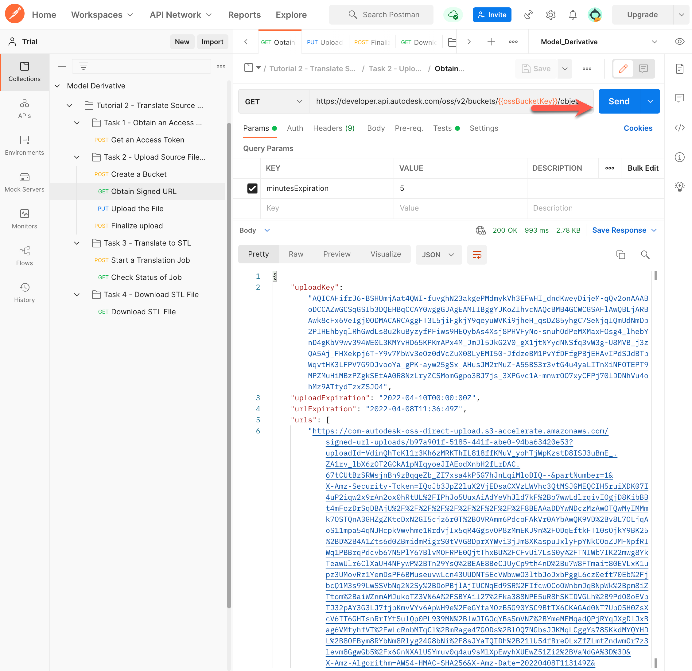

# Task 2 - Upload Zip FIle to OSS

The Object Storage Service (OSS) is a generic Cloud Storage Service that is part of the Forge Data Management API. In this task, you upload a zip file containing the model to translate to OSS. While you can use any zip file containing a model, for the purpose of this tutorial we recommend that you use the file *Tuner.zip*, which is available in the [*tutorial_data*](../tutorial_data) folder.

## Create a Bucket

In this tutorial, you will use a Postman environment variable named `ossBucketKey` to hold the Object Key of the Bucket that contains your files in the cloud. If you already have a bucket (from a previous tutorial), carry out step 1, and ignore the rest.

1. Specify a value for the Bucket Key in the Postman Environment Variable named `ossBucketKey`:

    1. Click the **Environment quick look** icon (the eye icon) on the upper right corner of Postman.

    2. In the **CURRENT VALUE** column, in the **ossBucketKey** row, specify a name for the Bucket that stores your files.

        **Notes:**  
        - The Bucket name needs to be unique throughout the OSS service. if a Bucket with the name you specified already exists, the system will return a `409` conflict error in step 5. If you receive this error, change the value of this variable and try again.

        - The Bucket name must consist of only lower-case characters, numbers 0-9, and the underscore (_) character.

    3. Click the **Environment quick look** icon to hide the variables.

4. In the Postman sidebar, click **Task 2 - Upload Source File to OSS > POST Create a Bucket**. The request loads.

5. Click the **Body** tab, and verify that the `bucketkey` attribute has been set to the variable `ossBucketKey`.

5. Click **Send**. If the request is successful, you should see a screen similar to the following image.

   
    
## Obtain Signed URL

1. Use the following GET HTTP request to obtain the signed URL. https://developer.api.autodesk.com/oss/v2/buckets//objects//signeds3upload?minutesExpiration= 

2. Provide an Access token Authorization in Headers.

Note the use of `ossBucketkey` and `ossSourceFileObjectKey` as URI parameters.

3. Click the **Environment quick look** button and set the Postman environment variable `ossSourceFileObjectKey` to `Tuner.zip`, which you will use as the Object Key.

   

4. Define minutes expiration in Query parameters.

   

5. Click **Send**. This sends the request, and updates the following Postman environment variables:

   | Variable Name              | Description                                                                                 |
   |----------------------------|---------------------------------------------------------------------------------------------|
   | t2_ossSourceFileObjectKey  | Object Key of the source file. Should be `Tuner.zip`.                                         |
   | t2_ossSourceFileURN        | Value of the `objectId` attribute in the JSON response. This is the URN of the source file. |
   | t2_ossEncodedSourceFileURN | The URN of the source file, converted to a Base64-encoded URN.                              |
   | UploadKey | The URN to upload the file.                                                                                  |  
   
You should see a screen similar to the following image,
    
   
   
## Upload the file

1. Download the file *Tuner.zip* from the [*tutorial_data* folder of this tutorial](../tutorial_data).

2. Use the PUT request. Note the use of `ContentUploadSignedURL` as URI parameter.

3. Click the **Body** tab.

4. Select the **binary** option from the drop-down menu.

5. Click **Select File** and select the file *Tuner.zip*, which you downloaded in step 1.

   
   
6. Click **Send** to upload the file.

## Finalize Upload

1. Use the following POST HTTP request to obtain the signed URL.
https://developer.api.autodesk.com/oss/v2/buckets/{{ossBucketKey}}/objects/{{ossSourceFileObjectKey}}/signeds3upload

2. Define URI Parameters for Bucket key, Object key, and Upload key.

3. Click the **Body** tab, and verify that the `uploadKey` attribute has been set to the variable `UploadKey`.

   

4. Define Authorization and Content-Type Headers.

   

5. Click **Send** to finalize the upload.
You should see a screen similar to the following image:

   

[:rewind:](../readme.md "readme.md") [:arrow_backward:](task-1.md "Previous task") [:arrow_forward:](task-3.md "Next task")
