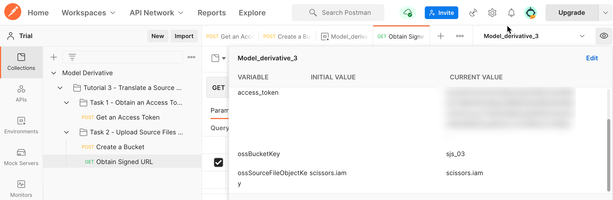
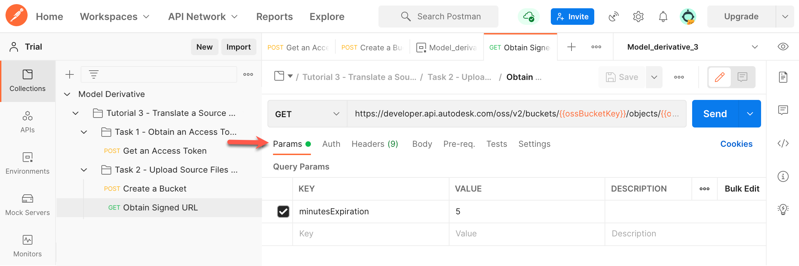
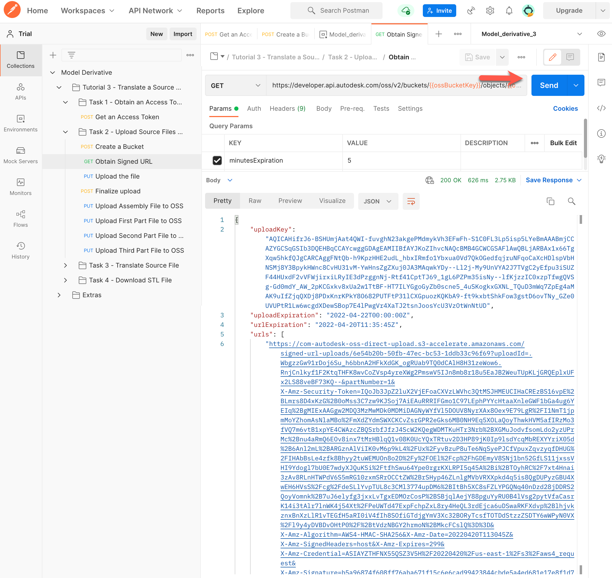
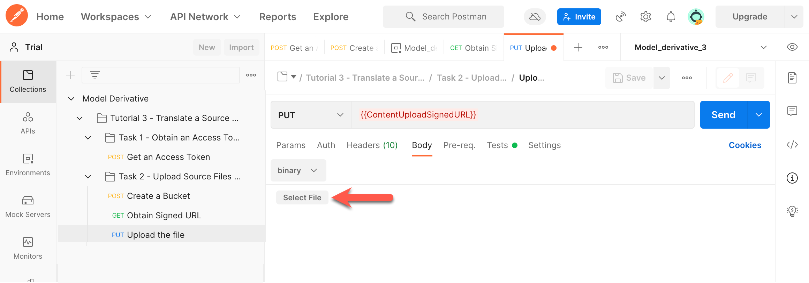
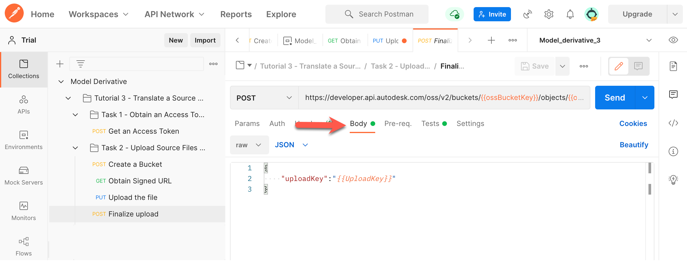
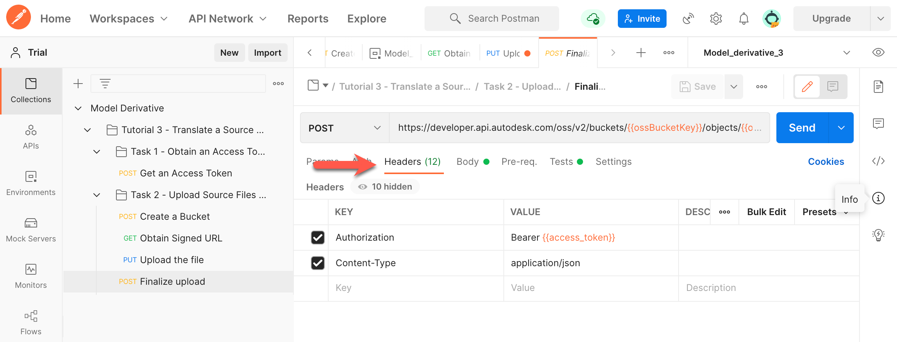

# Task 2 - Upload Source File to OSS

The Object Storage Service (OSS) is a generic Cloud Storage Service that is part of the Forge Data Management API. In this task, you upload an Inventor Assembly file (*scissors.iam*) and also the three Part files (*.ipt files) it references. The following image shows the folder structure that must be maintained between the Assembly file and Part files. 

These files are available in the [*tutorial_data*](../tutorial_data) folder.

## Create a Bucket

In this tutorial, you will use a Postman environment variable named `ossBucketKey` to hold the Object Key of the Bucket that contains your files in the cloud. If you already have a bucket (from a previous tutorial), carry out step 1, and ignore the rest.

1. Specify a value for the Bucket Key in the Postman Environment Variable named `ossBucketKey`:

    1. Click the **Environment quick look** icon (the eye icon) on the upper right corner of Postman.

    2. In the **CURRENT VALUE** column, in the **ossBucketKey** row, specify a name for the Bucket that stores your files.

        **Notes:**  
        - The Bucket name needs to be unique throughout the OSS service. if a Bucket with the name you specified already exists, the system will return a `409` conflict error in step 5. If you receive this error, change the value of this variable and try again.

        - The Bucket name must consist of only lower-case characters, numbers 0-9, and the underscore (_) character.

    3. Click the **Environment quick look** icon to hide the variables.

4. In the Postman sidebar, click **Task 2 - Upload Source File to OSS > POST Create a Bucket**. The request loads.

5. Click the **Body** tab, and verify that the `bucketkey` attribute has been set to the variable `ossBucketKey`.

5. Click **Send**. If the request is successful, you should see a screen similar to the following image.

    
    
## Obtain Signed URL

1. In the Postman sidebar, click **Task 2 - Upload Source File to OSS > GET Obtain Signed URL**. The request loads.

   Note the use of `ossBucketkey` and `ossSourceFileObjectKey` as URI parameters.

2. Click the **Environment quick look** button and set the Postman environment variable `ossSourceFileObjectKey` to `scissors.iam`, which you will use as the Object Key.

   

3. Click **Params** tab, and note the `minutesExpiration` parameter is defined as 5 minutes. Change this value to 10.

   

4. Click **Send**. A script in the **Tests** tab updates the following Postman environment variables:

   | Variable Name              | Description                                                                                 |
   |----------------------------|---------------------------------------------------------------------------------------------|
   | UploadKey | The upload key to upload the file.                                                                           |
   | ContentUploadSignedURL | URN to upload source file                                                                       |
   
You should see a screen similar to the following image:
   
   
   
## Upload the file

1. Download the file *scissors.iam* from the [*tutorial_data* folder of this tutorial](../tutorial_data).

2. In the Postman sidebar, click **Task 2 - Upload Source File to OSS > PUT Upload the File**. The request loads.

   Note the use of `ContentUploadSignedURL` as the URI.

3. Click the **Body** tab.

4. Click **Select File** and select the file *scissors.iam*, which you downloaded in step 1.

   
   
5. Click **Send** to upload the file.

## Finalize Upload

1. In the Postman sidebar, click **Task 2 - Upload Source File to OSS > POST Finalize Upload**. The request loads.

   Note the use of `ossBucketkey` and `ossSourceFileObjectKey` as URI parameters.

2. Click the **Body** tab, and verify that the `uploadKey` attribute has been set to the variable `UploadKey`.

   

3. Click **Headers** tab. Notice the `Authorization` and `Content-Type` Headers are already defined.

   

4. Click **Send** to finalize the upload. A script in the **Tests** tab updates the following Postman environment variables:

   | Variable Name              | Description                                                                                 |
   |----------------------------|---------------------------------------------------------------------------------------------|
   | t3_ossSourceFileObjectKey  | Object Key of the source file. Should be `Suspension.zip`.                                         |
   | t3_ossSourceFileURN        | Value of the `objectId` attribute in the JSON response. This is the URN of the source file. |
   | t3_ossEncodedSourceFileURN | The URN of the source file, converted to a Base64-encoded URN.                              |

    You should see a screen similar to the following image:

    

## Upload assembly file to OSS

1. Download the file *scissors.iam* from the [*tutorial_data* folder of this tutorial](../tutorial_data).

2. Set the Postman environment variable `ossAssemblyFile_OKey` to `scissors.iam`, which you will use as the Object Key for the assembly file you downloaded in the previous step. 

   1. Click the **Environment quick look** icon (the eye icon) on the upper right corner of Postman.

   2. In the **CURRENT VALUE** column, in the **ossAssemblyFile_OKey** row, specify `scissors.iam` as the value for that variable. 

   3. Click the **Environment quick look** icon to hide the variables.

2. In the Postman sidebar, click **Task 2 - Upload Source File to OSS > PUT Upload Assembly File to OSS**. The request loads.

    Note the use of `ossBucketkey` and `ossAssemblyFile_OKey` as URI parameters.

3. Click the **Body** tab.

4. Click **Select File** and select the file *scissors.iam*, which you downloaded in step 1.

    

5. Click **Send**. This sends the request, and updates the following Postman environment variables:

   | Variable Name                | Description                                                                                                   |
   |------------------------------|---------------------------------------------------------------------------------------------------------------|
   | t3_ossAssemblyFileURN        | Value of the `objectId` attribute in the JSON response. This is the URN of the assembly file *scissors.iam*.  |
   | t3_ossEncodedAssemblyFileURN | The URN of the assembly file, converted to a Base64-encoded URN.                                              |

   You should see a screen similar to the following image:

    

## Upload part files to OSS

The [*tutorial_data*](../tutorial_data) folder contains another folder named [*Components*](../tutorial_data/Components). This folder contains three part files, which you must upload to OSS. The instructions in this sections walk you through the process of uploading the first part file, *blade_main.ipt*. Use the same process to upload the other two part files to OSS.

1. Download a part file from the [*tutorial_data/Components* folder of this repository](../tutorial_data/Components).

2. Set the Postman environment variable `ossPart_01_OKey` to the name of the part file you downloaded in the previous step. 

   1. Click the **Environment quick look** icon (the eye icon) on the upper right corner of Postman.

   2. In the **CURRENT VALUE** column, in the **ossPart_01_OKey** row, specify the name of the part file as the value for that variable. 

   3. Click the **Environment quick look** icon to hide the variables.

3. In the Postman sidebar, click **Task 2 - Upload Source File to OSS > PUT First Part to OSS**. The request loads.

4. Click the **Body** tab.

5. Click **Select File** and select the file part file you downloaded in step 1.

6. Click **Send**. This sends the request, and updates a Postman environment variable named "t3_ossPart_01_URN" with the `objectId` from the JSON response.

7. Repeat steps 1 through 5 for the remaining part files, setting the variables `ossPart_02_OKey`, and `ossPart_03_OKey` to each of the part file names, and using the following HTTP requests:

    1. **Task 2 - Upload Source File to OSS > PUT Second Part to OSS**.

    2. **Task 2 - Upload Source File to OSS > PUT Third Part to OSS**.

    You should see a screen similar to the following, when you click the **Environment quick look** icon. 

    

[:rewind:](../readme.md "readme.md") [:arrow_backward:](task-1.md "Previous task") [:arrow_forward:](task-3.md "Next task")
