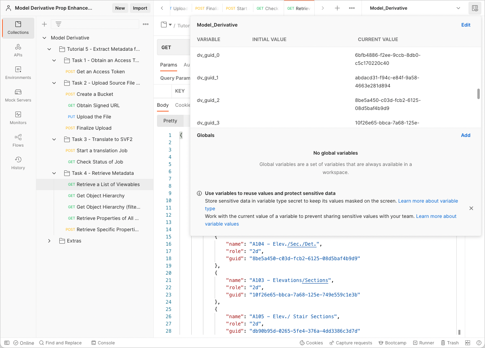
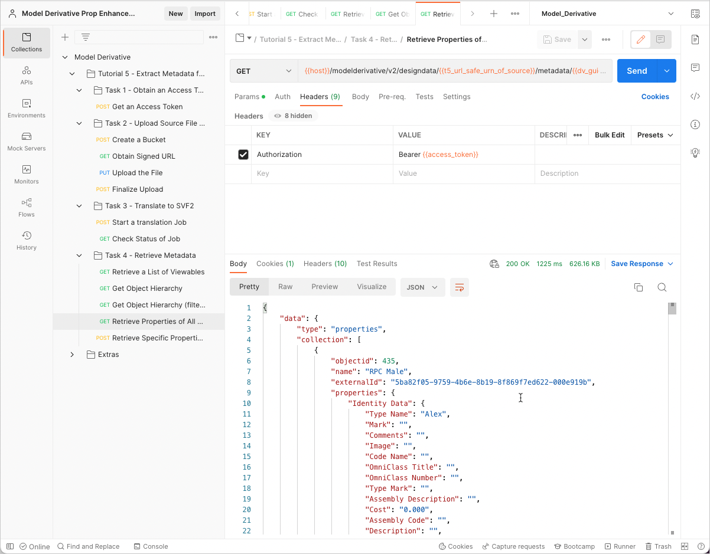

# Task 4 - Extract Metadata

In this task, you extract metadata that was generated in Task 3. Initially you retrieve a list of model views (Viewables) that can be displayed in the viewer. Unlike Inventor and Fusion 360, which contain only one Viewable per source file, Revit files can contain multiple Viewables. The Revit file you used for this tutorial contains seven Viewables. After you retrieve the Viewables, you select one and use its ID to extract the properties of the objects in the Viewable.

## Retrieve a List of Viewables

To obtain a list of Viewables, you will use the URL safe Base64-encoded URN of the source file in the next request. Postman saved this URN to the variable `t5_url_safe_urn_of_source` in the previous task.

1. In the Postman sidebar, click **Task 4 - Retrieve Metadata > Retrieve a List of Viewables**. The request loads.

2. Click **Send**. You should see a screen like the following image.

   

   A script in the **Tests** tab saves the GUIDs of the Viewables to a series of variables: `dv_guid_0` to `dv_guid_6`.

   
   
## Get Object Hierrarchy

Once you know the GUID of a Viewable, you can get the object tree of that Viewable. The Viewable you will query in the next request is the Viewable labeled `XXXXX`. The GUID of this Viewable was stored in the Postman environment variable `dv_guid_0`.

## Retrieve Properties of All Objects in a Viewable

The Viewable you will query in the next request is the Viewable labeled `A001 - Title Sheet`. The GUID of this Viewable was stored in the Postman environment variable `dv_guid_6`.

1. In the Postman sidebar, click **Task 4 - Retrieve Metadata > Retrieve Properties of Objects in a  Viewable**. The request loads.

   

   Note the use of the variable `dv_guid_6` as a URI parameter.

2. Click **Send**. If extracting properties takes time, you see a screen like the following.

   

3. Click **Send** again. You should see a screen like the following.

   

The response body contains the list of object properties.

[:rewind:](../readme.md "readme.md") [:arrow_backward:](task-3.md "Previous task")

