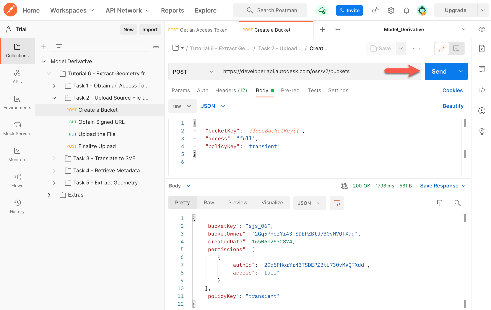
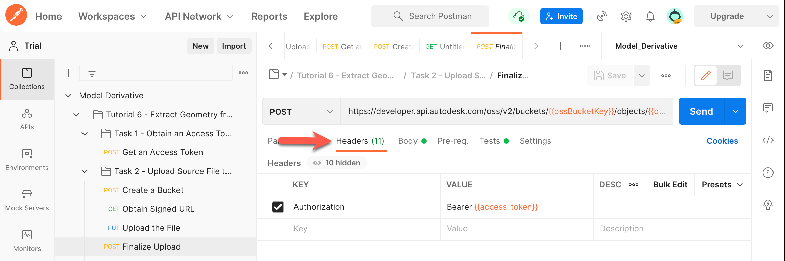
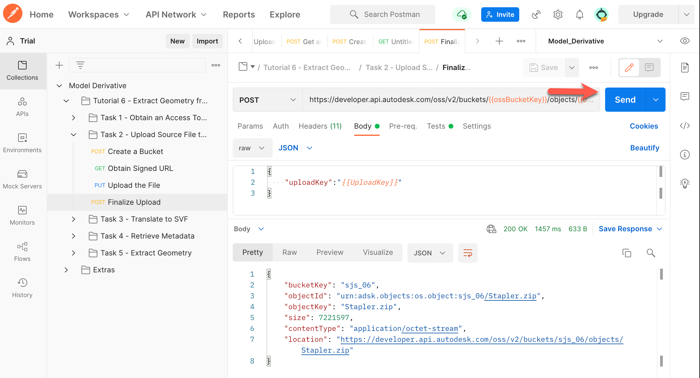

# Task 2 - Upload Source File to OSS

The Object Storage Service (OSS) is a generic Cloud Storage Service that is part of the Forge Data Management API. In this task, you upload a zip file (*Stapler.zip*) containing an Inventor Assembly and Part files to OSS. While you can use any model, we recommend that you use the model we provide. 

## Create a Bucket

In this tutorial, you  use a Postman environment variable named `ossBucketKey` to hold the Object Key of the Bucket that contains your files in the cloud. If you already have a bucket (from a previous tutorial), carry out step 1, and ignore the rest.

1. Specify a value for the Bucket Key in the Postman Environment Variable named `ossBucketKey`:

    1. Click the **Environment quick look** icon (the eye icon) on the upper right corner of Postman.

    2. In the **CURRENT VALUE** column, in the **ossBucketKey** row, specify a name for the Bucket that stores your files.

        **Notes:**  
        - The Bucket name needs to be unique throughout the OSS service. If a Bucket with the name you specified already exists, the system returns a `409` conflict error in step 5. If you receive this error, change the value of this variable and try again.

        - The Bucket name must consist of only lower-case characters, numbers 0-9, and the underscore (_) character.

    3. Click the **Environment quick look** icon to hide the variables.

4. In the Postman sidebar, click **Task 2 - Upload Source File to OSS > POST Create a Bucket**. The request loads.

5. Click the **Body** tab, and verify that the `bucketkey` attribute has been set to the variable `ossBucketKey`.

5. Click **Send**. If the request is successful, you should see a screen similar to the following image.

    
    
## Obtain Signed URL

1. In the Postman sidebar, click **Task 2 - Upload Source File to OSS > GET Obtain Signed URL**. The request loads.

   Note the use of `ossBucketkey` and `ossSourceFileObjectKey` as URI parameters.

2. Click the **Environment quick look** button and set the Postman environment variable `ossSourceFileObjectKey` to `Stapler.zip`, which you will use as the Object Key.

   

3. Click **Params** tab, and note the `minutesExpiration` is defined as 5 minutes. Change this value to 10.

   

4. Click **Send**. A script in the **Tests** tab updates the following Postman environment variables:

   | Variable Name              | Description                                                                                 |
   |----------------------------|---------------------------------------------------------------------------------------------|
   | UploadKey | The upload key to upload the file.                                                                           |
   | ContentUploadSignedURL | URN to upload source file                                                                       |
   
You should see a screen similar to the following image:
   
   
   
## Upload the file

1. Download the file *Stapler.zip* from the [*tutorial_data* folder of this tutorial](../tutorial_data).

2. In the Postman sidebar, click **Task 2 - Upload Source File to OSS > PUT Upload the File**. The request loads.

   Note the use of `ContentUploadSignedURL` in URI.

3. Click the **Body** tab.

4. Click **Select File** and select the file *Stapler.zip*, which you downloaded in step 1.

   
   
5. Click **Send** to upload the file.

## Finalize Upload

1. In the Postman sidebar, click **Task 2 - Upload Source File to OSS > POST Finalize Upload**. The request loads.

   Note the use of `ossBucketkey` and `ossSourceFileObjectKey` as URI parameters.

2. Click the **Body** tab, and verify that the `uploadKey` attribute has been set to the variable `UploadKey`.

   

3. Click **Headers** tab, and note the `Authorization` Header.

   

4. Click **Send** to finalize the upload. A script in the **Tests** tab updates the following Postman environment variables:

   | Variable Name              | Description                                                                                 |
   |----------------------------|---------------------------------------------------------------------------------------------|
   | t6_ossSourceFileObjectKey  | Object Key of the source file. Should be `Stapler.zip`.                                         |
   | t6_ossSourceFileURN        | Value of the `objectId` attribute in the JSON response. This is the URN of the source file. |
   | t6_ossEncodedSourceFileURN | The URN of the source file, converted to a Base64-encoded URN.                              |

    You should see a screen similar to the following image:

    

[:rewind:](../readme.md "readme.md") [:arrow_backward:](task-1.md "Previous task") [:arrow_forward:](task-3.md "Next task")
