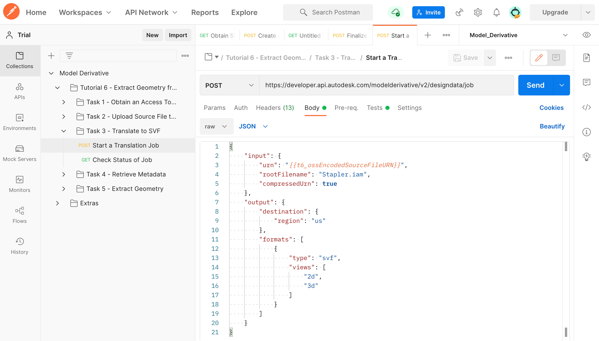
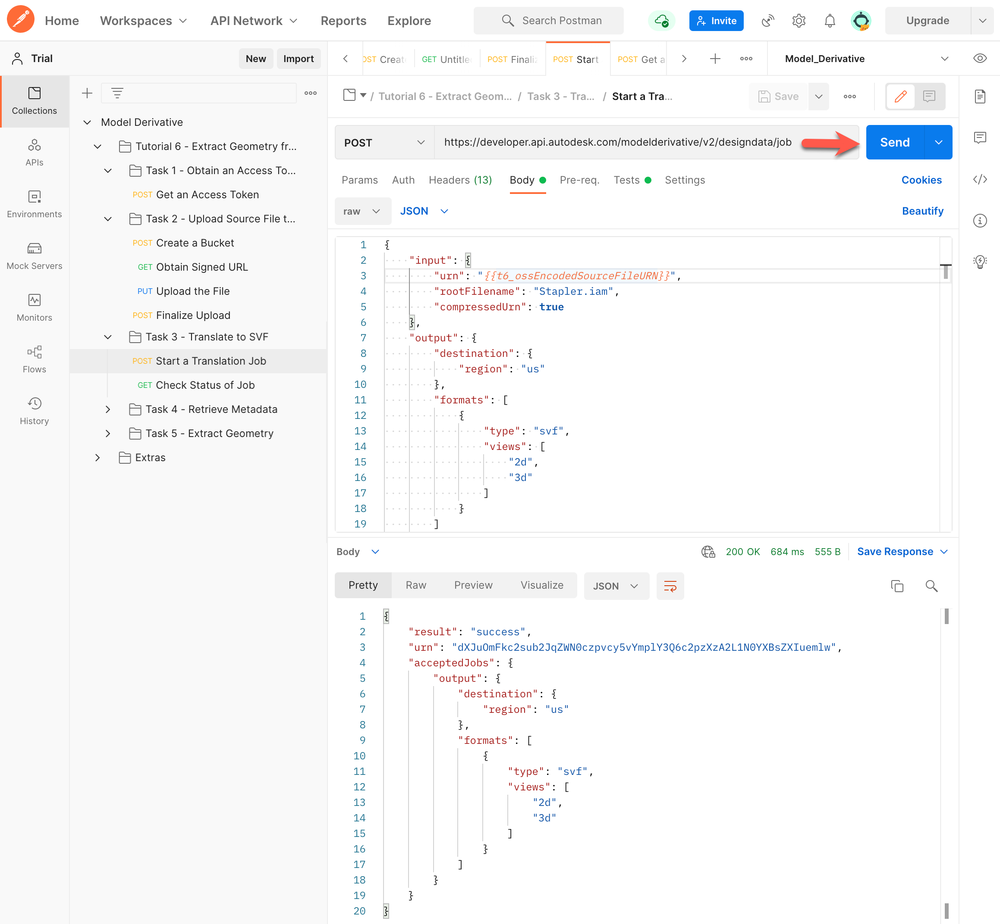
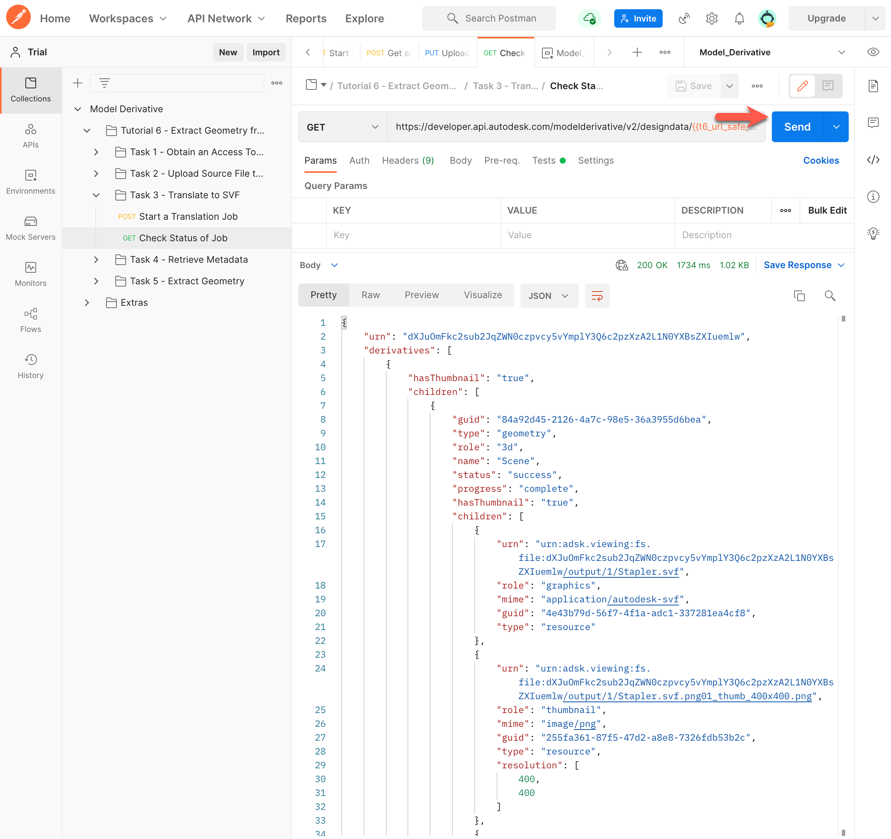

# Task 3 – Translate Source File

To extract geometry from a model, you must first translate the model to a viewer-friendly format. While this tutorial translates the model to SVF, you can just as well translate to SVF2.  The procedure to extract geometry is identical for both formats.

## Start a translation job

For this task, you use the Base64-encoded URN of the source file. In the previous task, Postman saved this URN to the variable `t6_ossEncodedSourceFileURN`, which you  use in the next request.

1. In the Postman sidebar, click **Translate to SVF > Start a Translation Job**. The request loads.

2. Click the **Body** tab and take note of the JSON payload.

    

    Note the name of the Inventor assembly file in the JSON body.

3. Click **Send**. If the request is successful, you should see a screen similar to the following image.

    

    Note the `urn` parameter in the JSON response. The value of this parameter is the URL-safe Base64 encoded URN of the source file. A script in the **Tests** tab, saves this value to a variable named `t6_url_safe_urn_of_source`.

## Check status of translation job

When you kick off a translation job, it takes time to complete. There are two ways to check if the translation job is done:

- Periodically check the status of the translation job.

- Set up a webhook to notify you when the job is done.

For this tutorial, you check the status of the translation job. For more information on webhooks, see the [documentation on Model Derivative webhook events](https://forge.autodesk.com/en/docs/webhooks/v1/reference/events/model_derivative_events)

1. In the Postman sidebar, click **Translate to SVF > Check Status of Job**. The request loads.

   

   Notice how the URL-safe Base64-encoded URN of the source file is used as a URI parameter (the `t6_url_safe_urn_of_source` variable).

2. Click **Send**. A screen similar to the following image is displayed.

   

   Repeat this step until the `progress` attribute becomes `complete`, as shown in the image.

[:rewind:](../readme.md "readme.md") [:arrow_backward:](task-2.md "Previous task") [:arrow_forward:](task-4.md "Next task")
