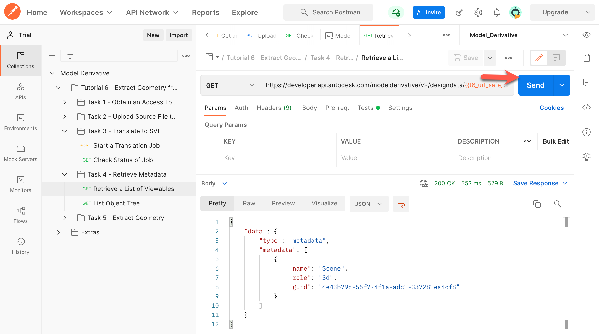
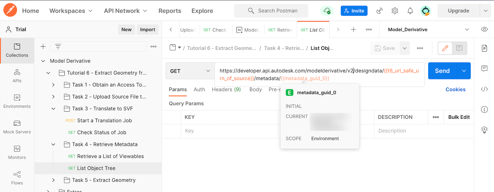
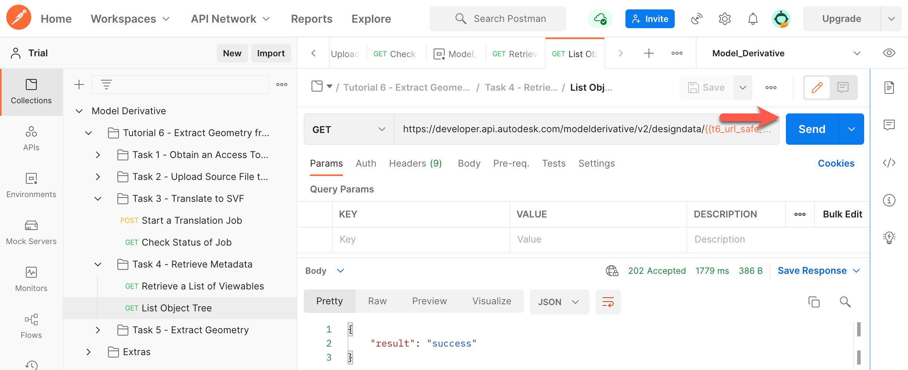
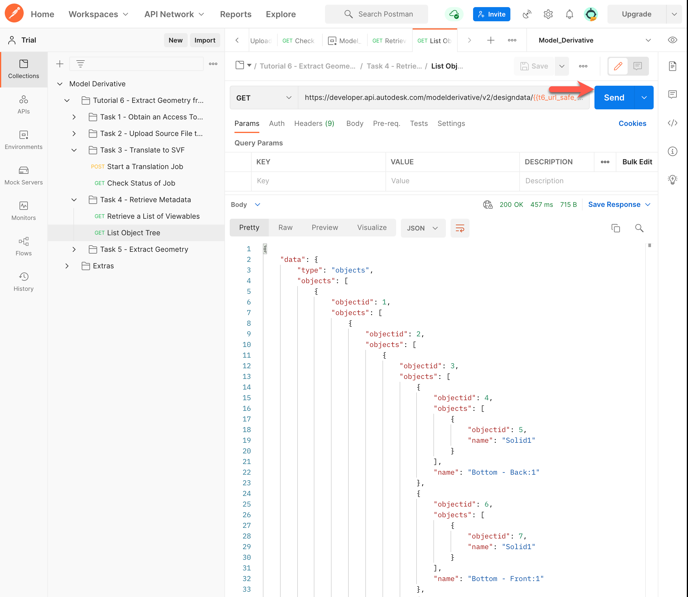

# Task 4 - Extract Metadata

To extract geometry, you must know the object IDs of the geometries to extract. To get the object ID of geometry you must first get the metadata GUID of the Viewable it resides on.

## Retrieve a list of Viewables

In order to obtain a list of Viewables, you will use the URL safe Base64-encoded URN of the source file in the next request. Postman saved this URN to the variable `t6_url_safe_urn_of_source` in the previous task.

1. In the Postman sidebar, click **Task 4 - Retrieve Metadata > Retrieve a List of Viewables**. The request loads.

2. Click **Send**. You should see a screen like the following image.

   

   Notice that the model has only one Viewable. (Inventor and Fusion 360 models have only one Viewable. Revit models can have multiple Viewables.) A script in the **Tests** tab saves the metadata GUID of the Viewable to a variable named `metadata_guid_0`.

## Retrieve the Object Tree of Viewable

1. In the Postman sidebar, click **Task 4 - Retrieve Metadata > List Object Tree**. The request loads.

   

   Note the use of the variable `metadata_guid_0` as a URI parameter.

2. Click **Send**. If extracting properties takes time, you see a screen like the following. 

   

3. Click **Send** again. You should see a screen like the following. 

   

The response body contains the list of object properties.

[:rewind:](../readme.md "readme.md") [:arrow_backward:](task-3.md "Previous task") [:arrow_forward:](task-5.md "Next task")
