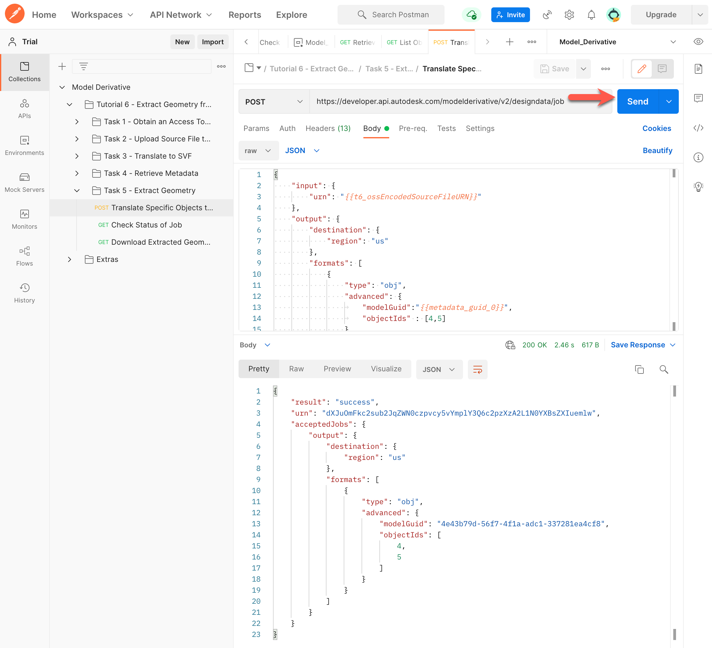
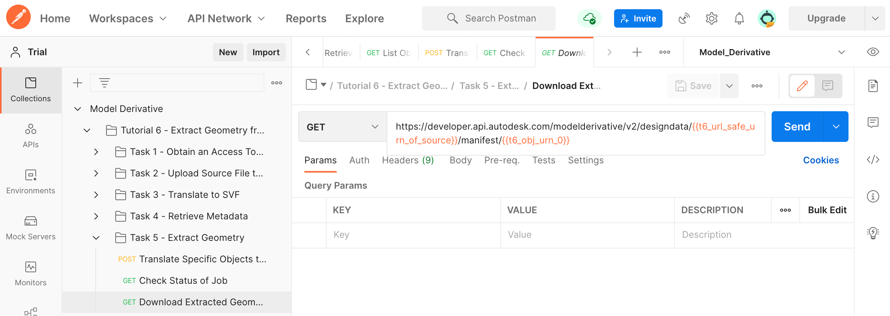
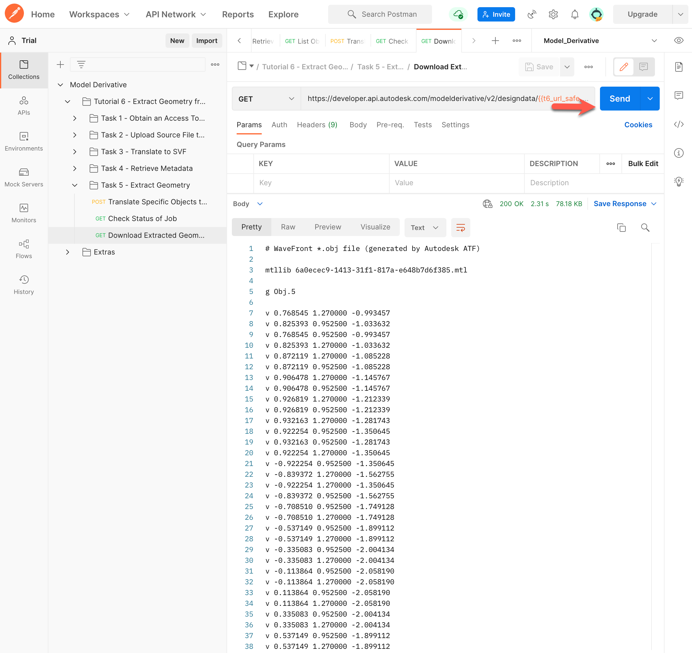

# Task 5 - Extract Geometry

Once the object tree has been retrieved, you can pick objects by their ID, and translate them into the OBJ format. Note that when you translate specific objects, you can only translate to the OBJ format.

## Translate specific objects to OBJ

1. In the Postman sidebar, click **Task 5 - Extract Geometry > Translate Specific Objects to OBJ**. The request loads.

2. Click the **Body** tab and take note of the JSON payload.

   

   Note the use of the Id of the Viewable (the variable `metadata_guid_0`)

2. Click **Send**. You should see a screen like the following image.

   

## Check status of translation job

1. In the Postman sidebar, click **Task 5 - Extract Geometry > Check Status of Job**. The request loads.

   

   Note the similarity of the request that you sent when you orginally translated the file to SVF.

2. Click **Send**. If the request is successful, you should see a screen similar to the following image. 

   

   Note how the newly generated derivatives are appended to the existing list of derivatives in the manifest.

   A script in the **Tests** tab saves the URN of the translated OBJ file to the variable `t6_obj_urn_0`.

## Download extracted geometry

1. In the Postman sidebar, click **Task 5 - Extract Geometry > GET Download Extracted Geometry**. The request loads.

    

    Note the use of the variable `t6_obj_urn_0` as a URI parameters.

2. Click **Send**. You should see a screen similar to the following image.

    

3. In the response area, click **Save Response > Save to a file**. Save the file as *objects.obj*, when prompted.

    

Congratulations! You have completed this tutorial.

To display the saved file:

- If you are using an Apple Macintosh, right-click *objects.obj* in Finder and select **Quick Look** from the menu.

- If you are using Windows, right-click *objects.obj* in Windows Explorer and select **Open with > 3D Viewer** from the menu.

[:rewind:](../readme.md "readme.md") [:arrow_backward:](task-4.md "Previous task")
