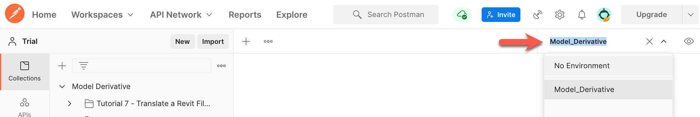

# Before you begin...

## Import the Postman Collection and Postman environment.

Postman Collections are groups of prepopulated HTTP requests. They can also contain scripts that are executed when you send an HTTP request, and receive a response.

Postman environments are named configurations that implement environment variables to store values you typically use across many HTTP requests. For example, this Postman Collection stores the Access Token, which is used across most HTTP requests, through a variable named `access_token`.

To import the Postman Collection and environment you need for this tutorial:

1. Download the following files from the [*collections* folder](../collections).

    1. *Model Derivative.postman_collection.json*
    2. *Model_Derivative.postman_environment.json*

2. In the Postman header bar, click **Import**. A dialog displays.

3. Drag the file you downloaded in step 1 to the area marked **Drop files here**. Alternatively, you can click **Choose Files** and pick the files you downloaded in step 1.

3. Click the environment drop-down on the upper-right, and select **Model_Derivative**. The environment containing the variables for the tutorial loads.

   

[:rewind:](../readme.md "readme.md")  [:arrow_forward:](task-1.md "Next task")
