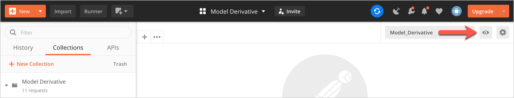
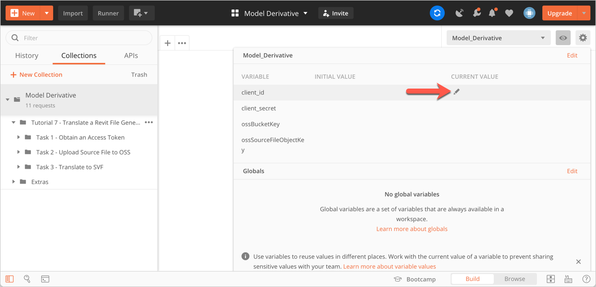
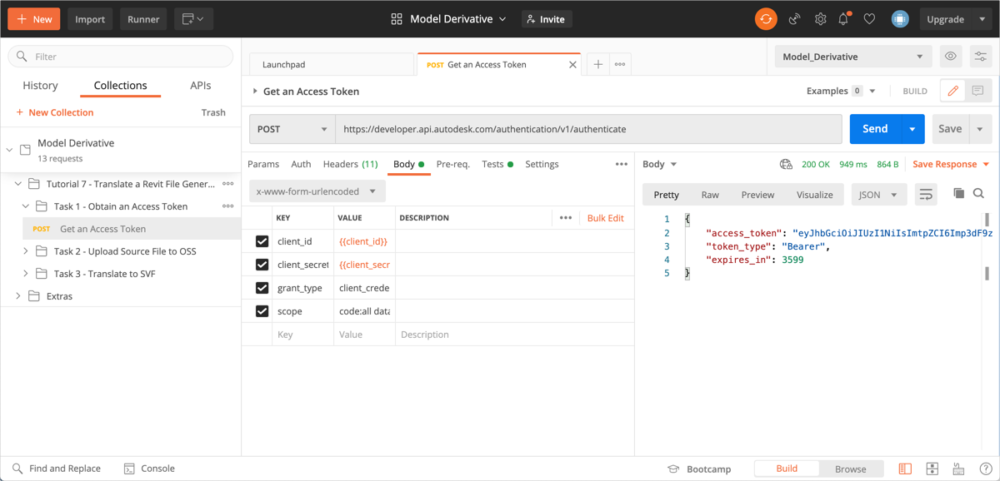
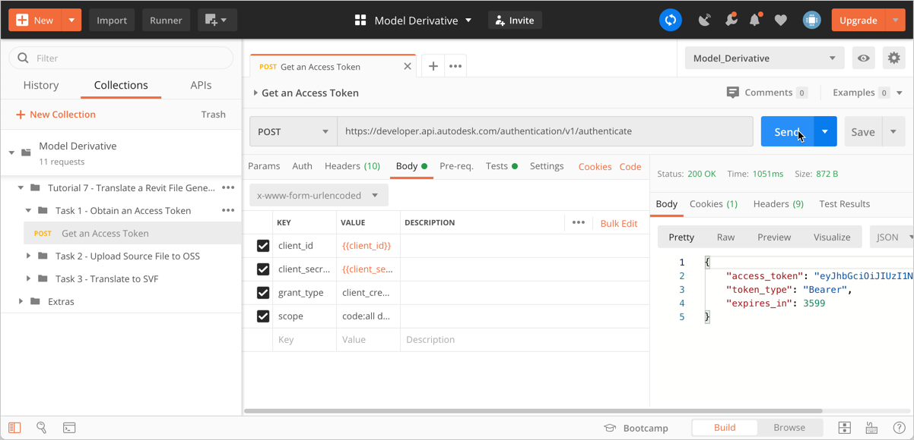

# Task 1 - Obtain an Access Token

## Create a Forge App

1. Follow the instructions on [Get Started with Forge in Three Steps](https://forge.autodesk.com/developer/start-now/signup)
to create a Forge App. In the *Add Services to Forge* stage, select "Model Derivative API" and "Data Management API".

2. Jot down the *Client ID* and *Client Secret* of the Forge App you created. You will need this in the next step.

## Save Client ID and Client Secret to Postman Environment Variables

In the Model_Derivative environment that you selected earlier, there are two Postman Environment Variables named `client_id` and `client_secret`. By setting these variables, you don't need to specify their values when you send HTTP requests to Forge.

To set the environment variables:

1. Click the **Environment quick look** icon on the upper right corner of Postman.

   

2. Click in the **CURRENT VALUE** column on the **client_id** row. The Edit icon displays.

    

3. Click the Edit icon, and enter the *Client ID* you jotted down earlier.

4. Similarly, enter the *Client Secret* you jotted down earlier, in the **CURRENT VALUE** column on the **client_secret** row.

5. Click the **Environment quick look** icon again to close it.

## Get an Access Token

To get an Access Token, you must send an `authenticate` request to Forge. The Postman Collection has a prepopulated authenticate request that you can send.

To send the authenticate request to Forge:

1. In the Postman sidebar, click **Task 1 - Obtain an Access Token > POST Get an Access Token**. The request loads.

2. Click the **Body** tab.

3. Move the cursor over the values for **client_id** and **client_secret** in the **VALUES** column, and verify that the values you specified as environment variables are displayed.

   

4. Click **Send**. This sends the HTTP request to Forge. If your request authenticates successfully, you should see a return status of **200 OK**, and the response will be similar to the following:

    

A script defined in the **Tests** tab saves the Access Token in the Postman environment variable `access_token`. Postman will pick up the Access Token from this variable for all subsequent requests, eliminating the need for you to repeatedly specify the value of the token. The token remains valid for one hour.  If the token expires, you must obtain a fresh token by sending an `authenticate` request to Forge once again. 

[:rewind:](../readme.md "readme.md") [:arrow_backward:](before_you_begin.md "Previous task") [:arrow_forward:](task-2.md "Next task")
