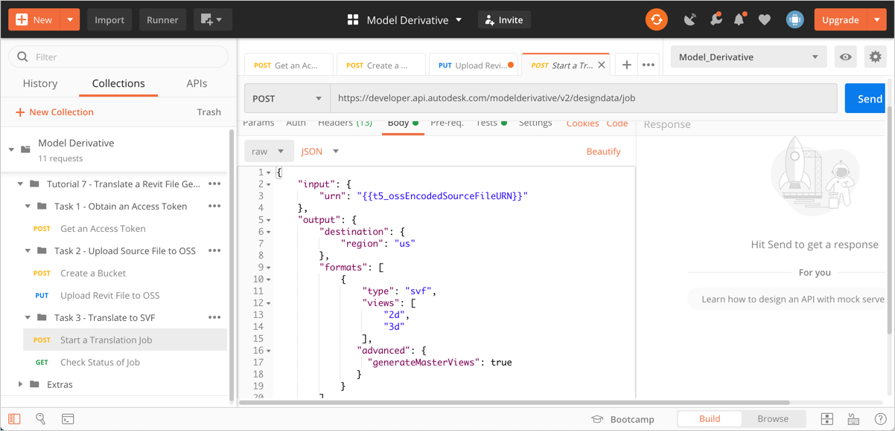
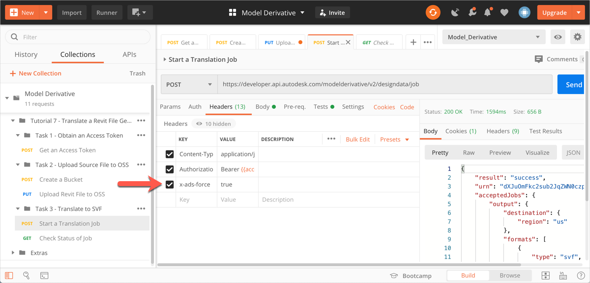
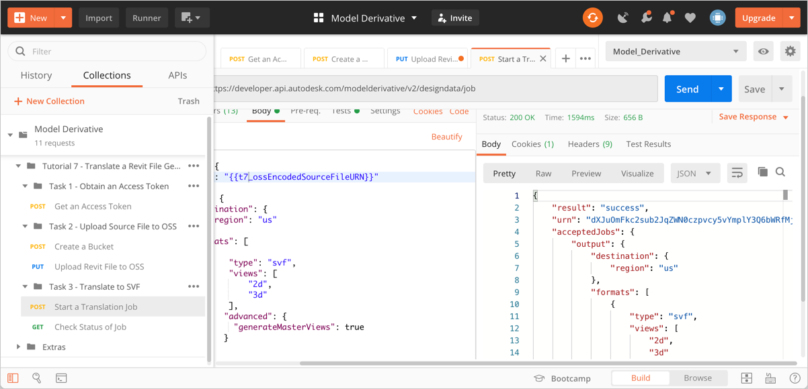

# Task 3 – Translate Source File

Before you can display a model in the Viewer, you must translate it to the SVF format. To generate zone and space information while translating, you must set a few specific options in the request header as well as the JSON body. Generating zone and space information can cause translation time to increase. As such, these options must be specified only when you need zone and space information. 

The translation job produces a manifest, which lists all the files that are generated. It also reports how far translation has progressed as a percentage, for each file listed in the manifest.

## Start a translation job

1. In the Postman sidebar, click **Task 3 - Translate to SVF > Start a Translation Job**. The request loads.

2. Click the **Body** tab and take note of the JSON payload.

    

    Note the use of the `generateMasterViews` attribute to instruct Forge that it must generate master views for each phase of the Revit model.

3. Click the **Header** tab and take note of the options that are specified.

   

   Note the `x-ads-force` header parameter, which has been set to `true`. Setting this header parameter ensures that the derivatives produced by any previous translation job for this source file is removed. This is mandatory for generating master views

3. Click **Send**. If the request is successful you should see a screen similar to the following image.

    

    Note the `urn` attribute in the JSON response. This is the URL-safe Base64 encoded URN of the source file. A script in the **Tests** tab, saves this value to a variable named `t7_url_safe_urn_of_source`.

## Check status of translation job

When you kick off a translation job, it takes time to complete. There are two ways to check if the translation job is done:

- Periodically check the status of the translation job.

- Set up a webhook to notify you when the job is done.

For the purpose of this tutorial you will check the status of the translation job, and wait for the `progress` attribute to become `complete`. For more information on webhooks, see the [documentation on Model Derivative webhook events](https://forge.autodesk.com/en/docs/webhooks/v1/reference/events/model_derivative_events)

1. In the Postman sidebar, click **Task 3 - Translate to SVF > Check Status of Job**. The request loads.

   

   Note the use of the URL-safe Base64-encoded URN of the source file as a URI parameter (the `t7_url_safe_urn_of_source` variable)

2. Click **Send**. You will see a screen similar to the following image.

   

   Repeat this step until the `progress` attribute becomes `complete`.

[:rewind:](../readme.md "readme.md") [:arrow_backward:](task-2.md "Previous task") [:arrow_forward:](task-4.md "Next task")
