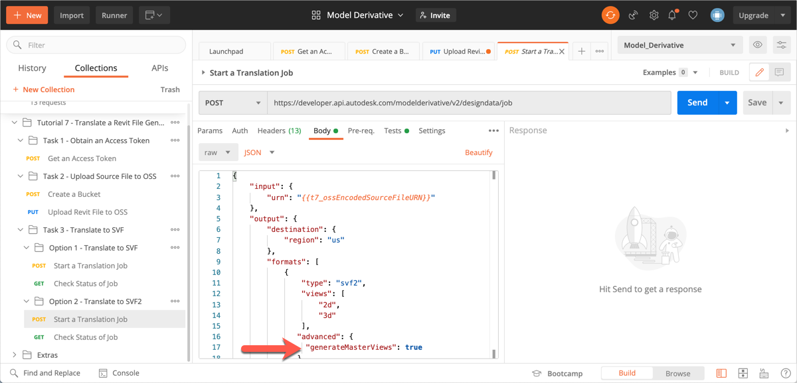
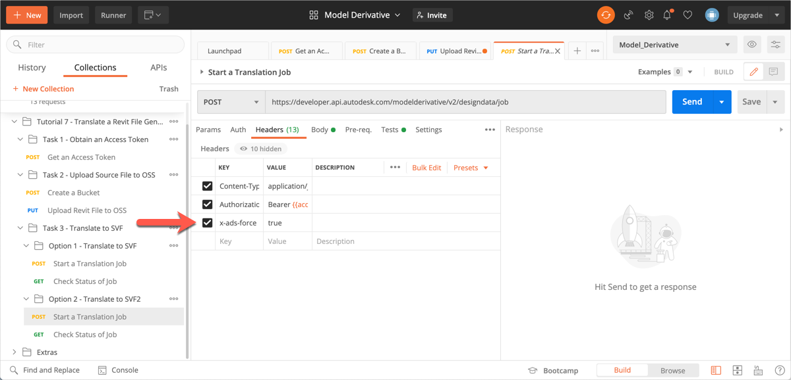
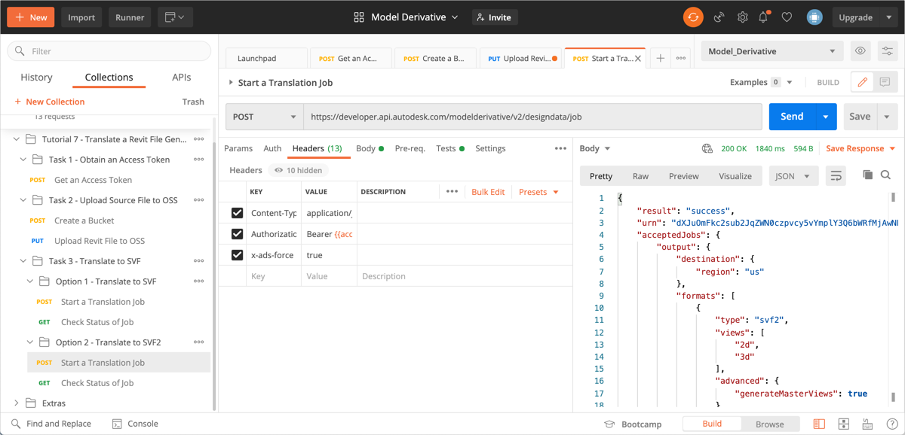
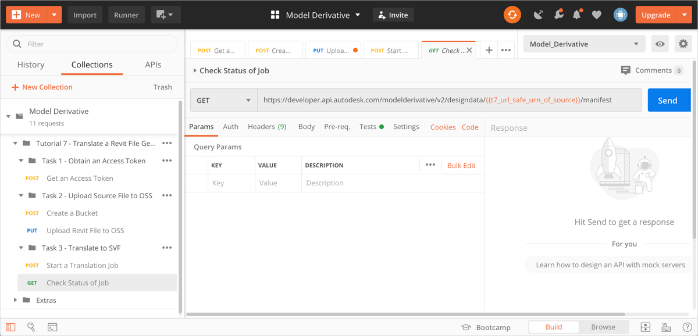
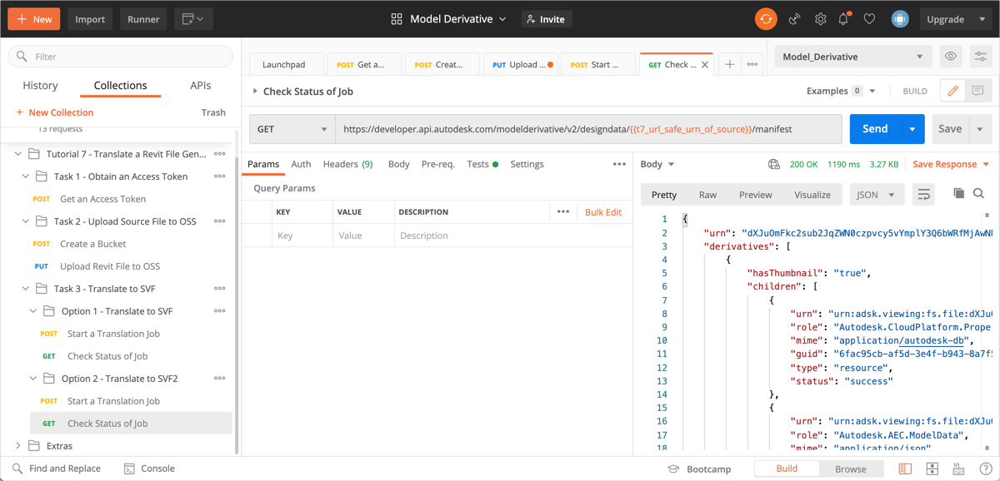

# Task 3, Option 2 – Translate to SVF2

To generate zone and space information while translating, you must set a few specific options in the request header and the JSON body. Generating zone and space information can cause translation time to increase. As such, these options must be specified only when you need zone and space information.

The translation job produces a manifest, which lists all the files that are generated. It also reports how far translation has progressed as a percentage, for each derivative listed in the manifest.

## Start a translation job

1. In the Postman sidebar, click **Task 3 - Translate Source File > Option 2 - Translate to SVF2 > Start a Translation Job**. The request loads.

2. Click the **Body** tab and take note of the JSON payload.

    

    Note the use of the `generateMasterViews` attribute to instruct Forge that it must generate master views for each phase of the Revit model.

3. Click the **Header** tab and take note of the options that are specified.

   

   Note the `x-ads-force` header parameter, which has been set to `true`. Setting this header parameter ensures that the derivatives produced by any previous translation job for this source file are removed. This setting is mandatory for generating master views

3. Click **Send**. If the request is successful you should see a screen similar to the following image.

    

    Note the `urn` parameter in the JSON response. This parameter contains the URL-safe Base64 encoded URN of the source file. A script in the **Tests** tab, saves this value to a variable named `t7_url_safe_urn_of_source`.

## Check status of translation job

When you kick off a translation job, it takes time to complete. There are two ways to check if the translation job is done:

- Periodically check the status of the translation job.

- Set up a webhook to notify you when the job is done.

For this tutorial, check the status of the translation job, and wait for the `progress` parameter to become `complete`. For more information on webhooks, see the [documentation on Model Derivative webhook events](https://forge.autodesk.com/en/docs/webhooks/v1/reference/events/model_derivative_events)

1. In the Postman sidebar, click Task 3 - Translate Source File > Option 2 - Translate to SVF2 > Check Status of Job**. The request loads.

   

   Notice how the URL-safe Base64-encoded URN of the source file is used as a URI parameter (by way of the `t7_url_safe_urn_of_source` variable)

2. Click **Send**. You see a screen similar to the following image.

   

   Repeat this step until the `progress` attribute becomes `complete`.

[:rewind:](../readme.md "readme.md") [:arrow_backward:](task-3.md "Previous task") [:arrow_forward:](task-4.md "Next task")
