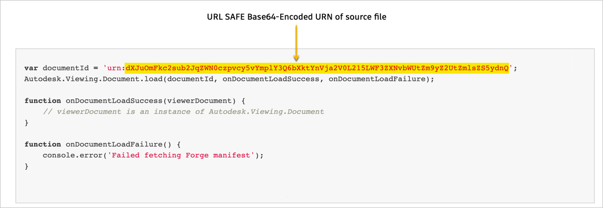
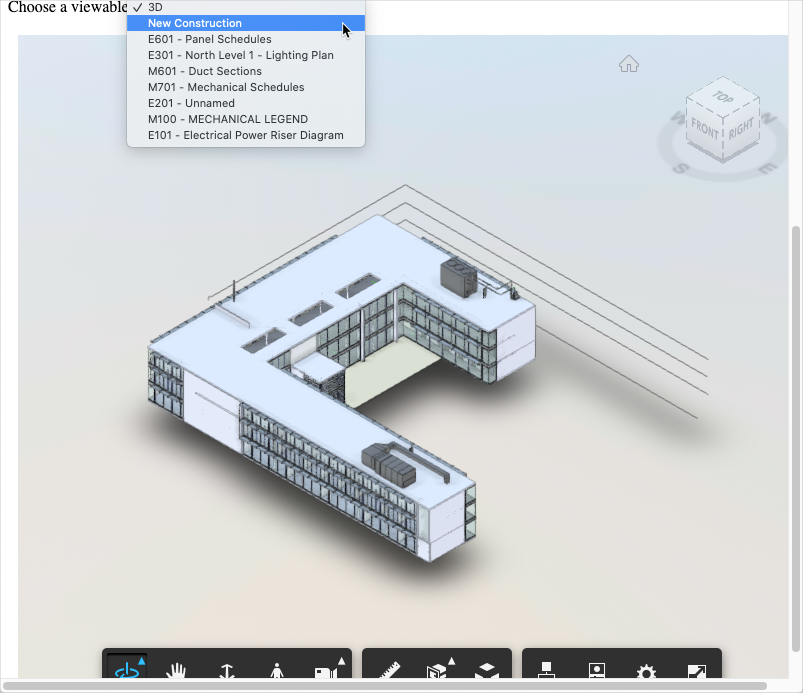
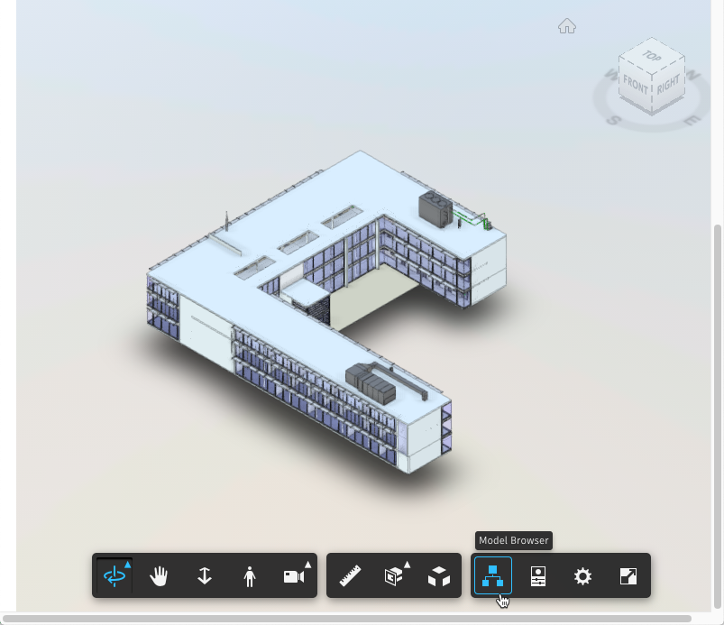
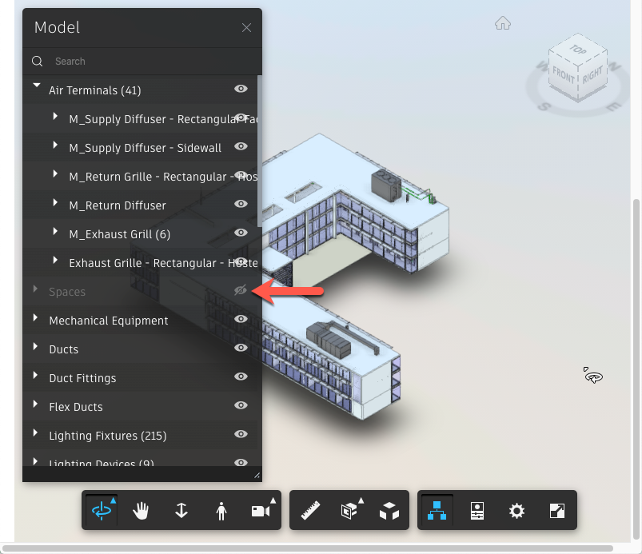

## Option 1: Embed the source file URN in an HTML page you create

1. Insert an instance of the Viewer in an HTML page, and initialize it as per the instructions provided in the following Viewer documentation topics on the Forge portal:

    a. [Add Viewer to an HTML Page](https://forge.autodesk.com/en/docs/viewer/v7/developers_guide/viewer_basics/starting-html/)

    b. [Intialize Viewer](https://forge.autodesk.com/en/docs/viewer/v7/developers_guide/viewer_basics/initialization/)

    **Note:**

    SVF and SVF2 require different settings for the `api` and `env` parameters at initialization. 
    See the following table for the values to use for this tutorial:

    | Parameter       | SVF                   | SVF2                   |
    |-----------------|-----------------------|------------------------|  
    | `api`           | derivativeV2          | streamingV2            |
    | `env`           | AutodeskProduction    | AutodeskProduction2    |

2. Embed the URL safe Base64-encoded URN of the source file, which you obtained in the previous task, as described in the topic [Load a Model](https://forge.autodesk.com/en/docs/viewer/v7/developers_guide/viewer_basics/load-a-model/)

Note: You must prepend ``urn:`` to the URL safe Base64-encoded URN, when you embed it in the JavaScript code, as shown in the following image.

## Option 2: Provide source file URN as an input to an existing HTML page

We have created two web pages based on the instructions provided in Option 1. One page is for SVF, and the other for SVF2. You can use them to verify the SVF/SVF2 file you just generated. 

1. Display the webpage by clicking the link in the relevant column from the following table:

| SVF                                                                                      | SVF2                                                                                      |
|:----------------------------------------------------------------------------------------:|:-----------------------------------------------------------------------------------------:|
| [Show Web page](https://autodesk-forge.github.io/forge-tutorial-postman/display_svf.html)|[Show Web page](https://autodesk-forge.github.io/forge-tutorial-postman/display_svf2.html) |
|                               |                          |
| [Show Source](../../docs/display_svf.html)                                               |[Show Source](../../docs/display_svf2.html)                                                |

2. In the **Access Token** box, specify the access token you obtained in task 1 of this tutorial.

3. In the **Source File URN (encoded)** box, specify the URL safe Base64-encoded URN of the source file, which you obtained in task 3.

4. Click **Submit**.

5. From the **Choose a viewable** drop-down, select **New Construction**.

  

6. Click the **Model Browser** button. The Model Browser displays.

  

  Note that spaces are now listed in the Model Browser. Spaces are hidden by default, just like they are in Revit. Click the "eye icon" next to **Spaces** to display it.

  

[:rewind:](../readme.md "readme.md") [:arrow_backward:](task-3.md "Previous task")
