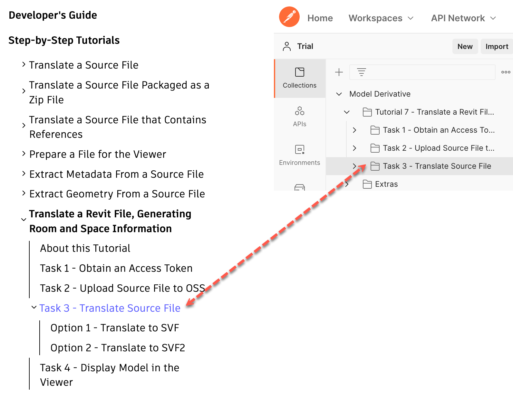
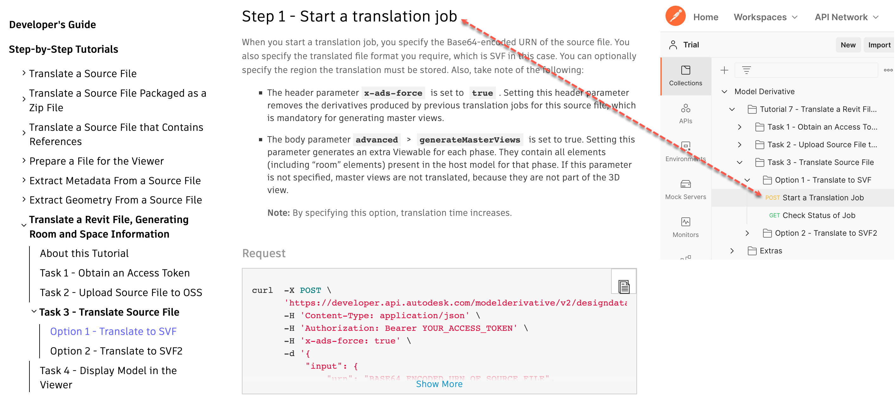

# Translate a Revit File, Generating Room and Space Information

This folder contains a Postman Collection corresponding to the Model Derivative Step-by-Step Tutorial [Translate a Revit File, Generating Room and Space Information](https://forge.autodesk.com/en/docs/model-derivative/v2/tutorials/prep-roominfo4viewer/).

In the Postman sidebar, requests are stored in folders that have the same name as the corresponding task in the tutorial on the Forge portal.

Individual requests in Postman have been named such that the corresponding step in the tutorial (on the Forge portal) can be figured out easily.

Instructions to run the Postman collection are as follows:

- [Before you begin](instructions/before_you_begin.md)
- [Task 1 - Obtain an Access Token](instructions/task-1.md)
- [Task 2 - Upload Source File to OSS](instructions/task-2.md)
- [Task 3 – Translate Source File](instructions/task-3.md)
  - [Task 3, Option 1 – Translate to SVF](instructions/task-3_op1.md)
  - [Task 3, Option 2 – Translate to SVF2](instructions/task-3_op2.md)
- [Task 4 - Display the Model in the Viewer](instructions/task-4.md)
